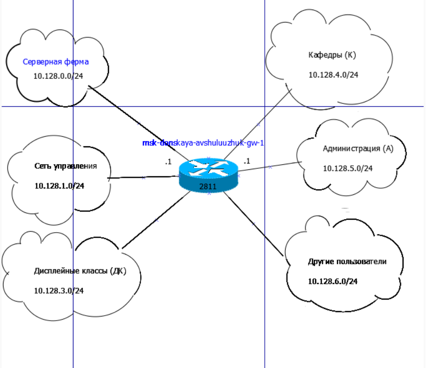
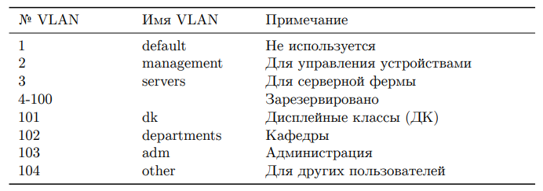
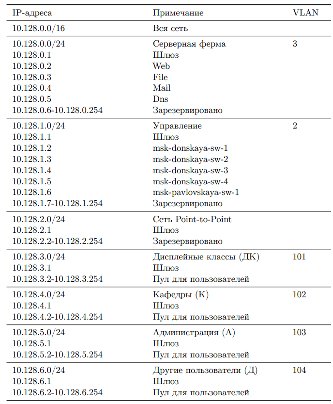
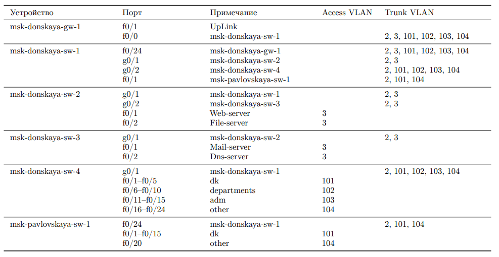
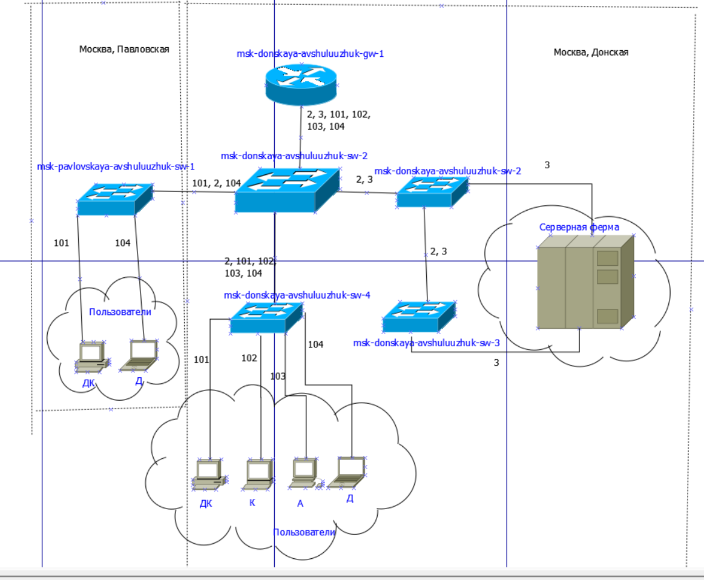
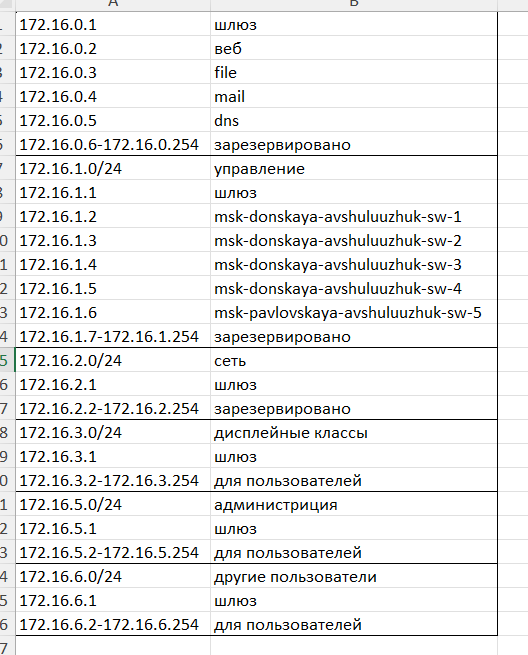
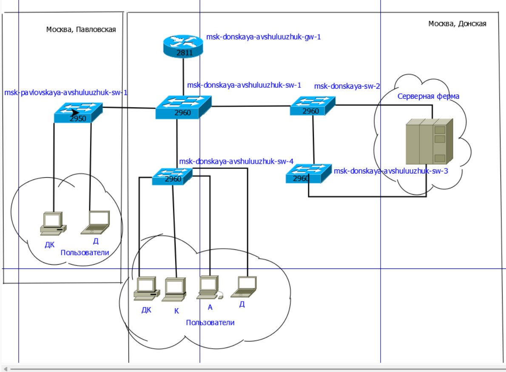

---
## Front matter
title: "Планирование локальной сети организации"
subtitle: "Лабораторная работа № 3"
author: "Шулуужук Айраана НПИбд-02-22"

## Generic otions
lang: ru-RU
toc-title: "Содержание"

## Bibliography
bibliography: bib/cite.bib
csl: pandoc/csl/gost-r-7-0-5-2008-numeric.csl

## Pdf output format
toc: true # Table of contents
toc-depth: 2
lof: true # List of figures
lot: true # List of tables
fontsize: 12pt
linestretch: 1.5
papersize: a4
documentclass: scrreprt
## I18n polyglossia
polyglossia-lang:
  name: russian
  options:
	- spelling=modern
	- babelshorthands=true
polyglossia-otherlangs:
  name: english
## I18n babel
babel-lang: russian
babel-otherlangs: english
## Fonts
mainfont: IBM Plex Serif
romanfont: IBM Plex Serif
sansfont: IBM Plex Sans
monofont: IBM Plex Mono
mathfont: STIX Two Math
mainfontoptions: Ligatures=Common,Ligatures=TeX,Scale=0.94
romanfontoptions: Ligatures=Common,Ligatures=TeX,Scale=0.94
sansfontoptions: Ligatures=Common,Ligatures=TeX,Scale=MatchLowercase,Scale=0.94
monofontoptions: Scale=MatchLowercase,Scale=0.94,FakeStretch=0.9
mathfontoptions:
## Biblatex
biblatex: true
biblio-style: "gost-numeric"
biblatexoptions:
  - parentracker=true
  - backend=biber
  - hyperref=auto
  - language=auto
  - autolang=other*
  - citestyle=gost-numeric
## Pandoc-crossref LaTeX customization
figureTitle: "Рис."
tableTitle: "Таблица"
listingTitle: "Листинг"
lofTitle: "Список иллюстраций"
lotTitle: "Список таблиц"
lolTitle: "Листинги"
## Misc options
indent: true
header-includes:
  - \usepackage{indentfirst}
  - \usepackage{float} # keep figures where there are in the text
  - \floatplacement{figure}{H} # keep figures where there are in the text
---

# Цель работы

Познакомится с принципами планирования локальной сети организации

# Задание

1. Используя графический редактор (например, Dia), требуется повторить
схемы L1, L2, L3, а также сопутствующие им таблицы VLAN, IP-адресов
и портов подключения оборудования планируемой сети.
2. Рассмотренный выше пример планирования адресного пространства сети
базируется на разбиении сети 10.128.0.0/16 на соответствующие подсети.
Требуется сделать аналогичный план адресного пространства для сетей
172.16.0.0/12 и 192.168.0.0/16 с соответствующими схемами сети и сопутствующими таблицами VLAN, IP-адресов и портов подключения оборудования.
3. При выполнении работы необходимо учитывать соглашение об именовании

# Выполнение лабораторной работы

Используя графический редактор (например, Dia), требуется повторим схемы L1, L2, L3 (рис. [-@fig:001]) (рис. [-@fig:002])  (рис. [-@fig:003]), а также сопутствующие им таблицы VLAN, IP-адресов и портов подключения оборудования планируемой сети (рис. [-@fig:004]) (рис. [-@fig:005])  (рис. [-@fig:006])

{#fig:001 width=70%}

{#fig:002 width=70%}

{#fig:003 width=70%}

{#fig:004 width=70%}

{#fig:005 width=70%}

{#fig:006 width=70%}

Рассмотренный выше пример планирования адресного пространства сети базируется на разбиении сети 10.128.0.0/16 на соответствующие подсети. Сделаем аналогичный план адресного пространства для сетей 172.16.0.0/12 и 192.168.0.0/16 с соответствующими схемами сети и сопутствующими таблицами VLAN, IP-адресов и портов подключения оборудования (рис. [-@fig:007]) (рис. [-@fig:008]) (рис. [-@fig:009]) (рис. [-@fig:010]) (рис. [-@fig:011]) (рис. [-@fig:012]) (рис. [-@fig:013]) (рис. [-@fig:014]) (рис. [-@fig:015]) (рис. [-@fig:016]) (рис. [-@fig:017]) (рис. [-@fig:018])

{#fig:007 width=70%}

{#fig:008 width=70%}

{#fig:009 width=70%}

{#fig:010 width=70%}

{#fig:011 width=70%}

{#fig:012 width=70%}

{#fig:013 width=70%}

{#fig:014 width=70%}

{#fig:015 width=70%}

{#fig:016 width=70%}

{#fig:017 width=70%}

{#fig:018 width=70%}

# Выводы

В результате выполнения лабораторной работы ознакомились с принципами планирования локальной сети организации

# Контрольные вопросы

1. Что такое модель взаимодействия открытых систем (OSI)? Какие уровни
в ней есть? Какие функции закреплены за каждым уровнем модели OSI?

Ответ: Модель взаимодействия открытых систем (OSI) — это концептуальная модель, описывающая, как системы взаимодействуют друг с другом в сети. Она делится на семь уровней:

    Физический уровень (Physical Layer): Передача сырых битов по физическим средам передачи.
    Канальный уровень (Data Link Layer): Обеспечение надежной передачи данных между узлами, управление доступом к среде передачи и обработка ошибок.
    Сетевой уровень (Network Layer): Определение маршрута для передачи пакетов данных между сетями.
    Транспортный уровень (Transport Layer): Обеспечение надежной или ненадежной передачи данных и управление потоком.
    Сеансовый уровень (Session Layer): Установка, управление и завершение сеансов между приложениями.
    Представительский уровень (Presentation Layer): Преобразование данных в формат, понятный приложению, включая кодирование и сжатие.
    Прикладной уровень (Application Layer): Взаимодействие с приложениями, предоставляющее интерфейсы для взаимодействия пользователей и программ.

2. Какие функции выполняет коммутатор?

Ответ: Коммутатор выполняет следующие функции:

    Обработка и передача данных между устройствами в локальной сети (LAN).
    Работа на канальном уровне, что позволяет ему обрабатывать MAC-адреса для переключения фреймов.
    Обеспечение изоляции трафика между различными сегментами сети.
    Поддержка функций VLAN для логической сегментации сети.

3. Какие функции выполняет маршрутизатор?

Ответ: Маршрутизатор выполняет такие функции:

    Перенаправление пакетов данных между разными сетями (например, между LAN и WAN).
    Работа на сетевом уровне, что позволяет обрабатывать IP-адреса.
    Определение маршрутов данных с помощью протоколов маршрутизации.
    Проведение NAT для преобразования внутренних IP-адресов в публичные.
    Обеспечение безопасного соединения с использованием межсетевых экранов и VPN.

4. В чём отличие коммутаторов третьего уровня от коммутаторов второго
уровня?

Ответ: Отличия коммутаторов второго уровня от коммутаторов третьего уровня:

    Коммутаторы второго уровня работают на канальном уровне и используют MAC-адреса для переключения данных внутри локальной сети.
    Коммутаторы третьего уровня работают на сетевом уровне и способны маршрутизировать трафик между различными подсетями, используя IP-адреса.

5. Что такое сетевой интерфейс?

Ответ: Сетевой интерфейс представляет собой точку подключения устройства к сети, обеспечивая возможность передачи и приема сетевых данных. Это может быть физический порт, микросхема или программное обеспечение, обеспечивающее сетевую связь.

6. Что такое сетевой порт?

Ответ: Сетевой порт — это физический или логический интерфейс, предоставляющий возможность подключения устройства к сети. Он может относиться как к физическим разъемам (RJ-45, SFP), так и к виртуальным портам, используемым в программном обеспечении.

7. Кратко охарактеризуйте технологии Ethernet, Fast Ethernet, Gigabit
Ethernet.

Ответ: технологии Ethernet:

    Ethernet: Стандартная технология локальных сетей с передачей данных на скорости до 10 Мбит/с. Использует метод передачи CSMA/CD.
    Fast Ethernet: Увеличивает скорость передачи до 100 Мбит/с, поддерживая обратную совместимость с классическим Ethernet.
    Gigabit Ethernet: Обеспечивает скорость передачи до 1 Гбит/с, также совместим с предыдущими стандартами и использует различные методы передачи (оптика, витая пара и т.д.).

8. Что такое IP-адрес (IPv4-адрес)? Определите понятия сеть, подсеть, маска
подсети. Охарактеризуйте служебные IP-адреса. Приведите пример с пояс-
нениями разбиения сети на две или более подсетей с указанием числа узлов
в каждой подсети.

Ответ: IP-адрес (IPv4-адрес) представляет собой уникальный числовой идентификатор устройства в сети, позволяя ему отправлять и получать данные. 

    Сеть — это часть адресного пространства, содержащая все устройства с одинаковыми первыми битами адреса.
    Подсеть — это логическое деление сети на меньшие сегменты для улучшения управления.
    Маска подсети — определяет, какая часть IP-адреса принадлежит сети, а какая — узлам.

Служебные IP-адреса, такие как 127.0.0.1 (localhost) или 0.0.0.0 (неопределенный адрес), предназначены для особых целей.

Пример разбиения сети на подсети: 

    Имеем сеть 192.168.1.0/24 (255.255.255.0), которая поддерживает 256 адресов. Разделим её на 4 подсети с маской /26 (255.255.255.192).
    Подсети будут:
        192.168.1.0/26 (64 адреса, 62 узла)
        192.168.1.64/26 (64 адреса, 62 узла)
        192.168.1.128/26 (64 адреса, 62 узла)
        192.168.1.192/26 (64 адреса, 62 узла)

9. Дайте определение понятию VLAN. Для чего применяется VLAN в сети
организации? Какие преимущества даёт применение VLAN в сети органи-
зации? Приведите примеры разных ситуаций.

Ответ: VLAN (Virtual Local Area Network) — это технология, которая позволяет создавать логически изолированные сети на основе одной физической инфраструктуры. 

    Применяется для разделения трафика, управления безопасностью и оптимизации производительности сети.
    Преимущества включают улучшение безопасности, оптимизацию трафика, снижение широковещательных доменов и упрощение управления сетью.
    Примеры использования: создание отдельной VLAN для отдела кадров и отдела маркетинга, чтобы ограничить доступ кадровиков к данным, чувствительным для маркетинга.

10. В чём отличие Trunk Port от Access Port?

Ответ: Отличия Trunk Port от Access Port:

    Access Port: Порт, который подключается к устройствам, не поддерживающим VLAN (например, компьютеры). На одном access port может находиться только одна VLAN.
    Trunk Port: Порт, который подключается к другим коммутаторам и поддерживает передачу трафика нескольких VLAN через одну физическую связь, используя тегирование (обычно 802.1Q) для идентификации VLAN.
