---
## Front matter
title: "Конфигурирование VLAN"
subtitle: "Лабораторная работа № 5"
author: "Шулуужук Айраана НПИбд-02-22"

## Generic otions
lang: ru-RU
toc-title: "Содержание"

## Bibliography
bibliography: bib/cite.bib
csl: pandoc/csl/gost-r-7-0-5-2008-numeric.csl

## Pdf output format
toc: true # Table of contents
toc-depth: 2
lof: true # List of figures
lot: true # List of tables
fontsize: 12pt
linestretch: 1.5
papersize: a4
documentclass: scrreprt
## I18n polyglossia
polyglossia-lang:
  name: russian
  options:
	- spelling=modern
	- babelshorthands=true
polyglossia-otherlangs:
  name: english
## I18n babel
babel-lang: russian
babel-otherlangs: english
## Fonts
mainfont: IBM Plex Serif
romanfont: IBM Plex Serif
sansfont: IBM Plex Sans
monofont: IBM Plex Mono
mathfont: STIX Two Math
mainfontoptions: Ligatures=Common,Ligatures=TeX,Scale=0.94
romanfontoptions: Ligatures=Common,Ligatures=TeX,Scale=0.94
sansfontoptions: Ligatures=Common,Ligatures=TeX,Scale=MatchLowercase,Scale=0.94
monofontoptions: Scale=MatchLowercase,Scale=0.94,FakeStretch=0.9
mathfontoptions:
## Biblatex
biblatex: true
biblio-style: "gost-numeric"
biblatexoptions:
  - parentracker=true
  - backend=biber
  - hyperref=auto
  - language=auto
  - autolang=other*
  - citestyle=gost-numeric
## Pandoc-crossref LaTeX customization
figureTitle: "Рис."
tableTitle: "Таблица"
listingTitle: "Листинг"
lofTitle: "Список иллюстраций"
lotTitle: "Список таблиц"
lolTitle: "Листинги"
## Misc options
indent: true
header-includes:
  - \usepackage{indentfirst}
  - \usepackage{float} # keep figures where there are in the text
  - \floatplacement{figure}{H} # keep figures where there are in the text
---

# Цель работы

Получить основные навыки по настройке VLAN на коммутаторах сети.

# Задание

1. На коммутаторах сети настроить Trunk-порты на соответствующих интерфейсах (см. табл. 3.2 из раздела 3.3), связывающих коммутаторы между собой.
2. Коммутатор msk-donskaya-sw-1 настроить как VTP-сервер и прописать на нём номера и названия VLAN согласно табл. 3.1 из раздела 3.3.
3. Коммутаторы msk-donskaya-sw-2 — msk-donskaya-sw-4, msk-pavlovskaya-sw-1 настроить как VTP-клиенты, на интерфейсах указать принадлежность к соответствующему VLAN (см. табл. 3.3 из раздела 3.3).
4. На серверах прописать IP-адреса, как указано в табл. 3.2 из раздела 3.3.
5. На оконечных устройствах указать соответствующий адрес шлюза и про- писать статические IP-адреса из диапазона соответствующей сети, следуя регламенту выделения ip-адресов (см. табл. 3.4 из раздела 3.3).
6. Проверить доступность устройств, принадлежащих одному VLAN, и недоступность устройств, принадлежащих разным VLAN.
7. При выполнении работы необходимо учитывать соглашение об именовании (см. раздел 2.5).
 
# Выполнение лабораторной работы

Проведем последовательность команд по конфигурации Trunk-порта на интерфейсе g0/1 коммутатора msk-donskaya-sw-1 (рис. [-@fig:001])

{#fig:001 width=70%}

Настроим Trunk-порты на соответствующих интерфейсах всех коммутаторов (рис. [-@fig:002]) (рис. [-@fig:003]) (рис. [-@fig:004]) (рис. [-@fig:005])

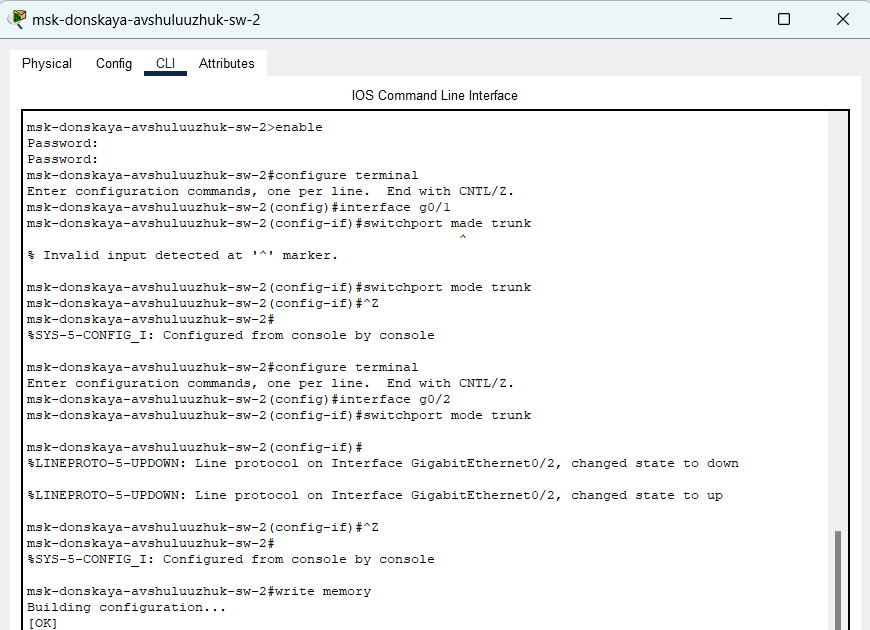{#fig:002 width=70%}

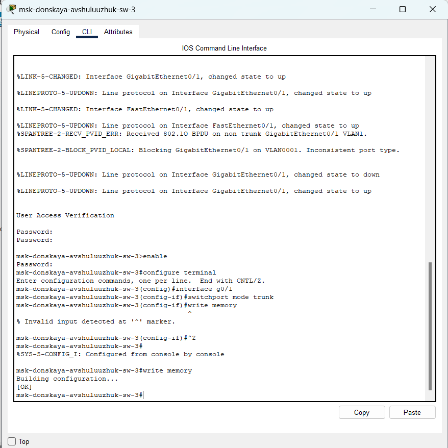{#fig:003 width=70%}

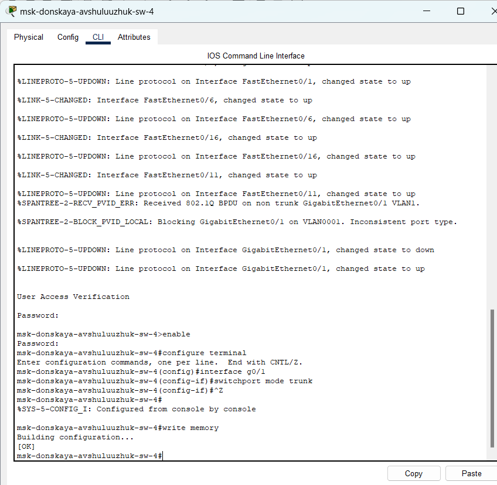{#fig:004 width=70%}

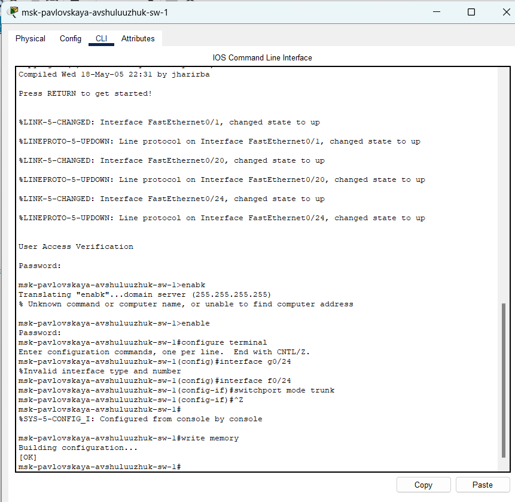{#fig:005 width=70%}

Проведем последовательность команд по конфигурации VTP, настроем коммутатор msk-donskaya-sw-1 как VTP-сервер и пропмшем на нём номера и названия VLAN (рис. [-@fig:006])

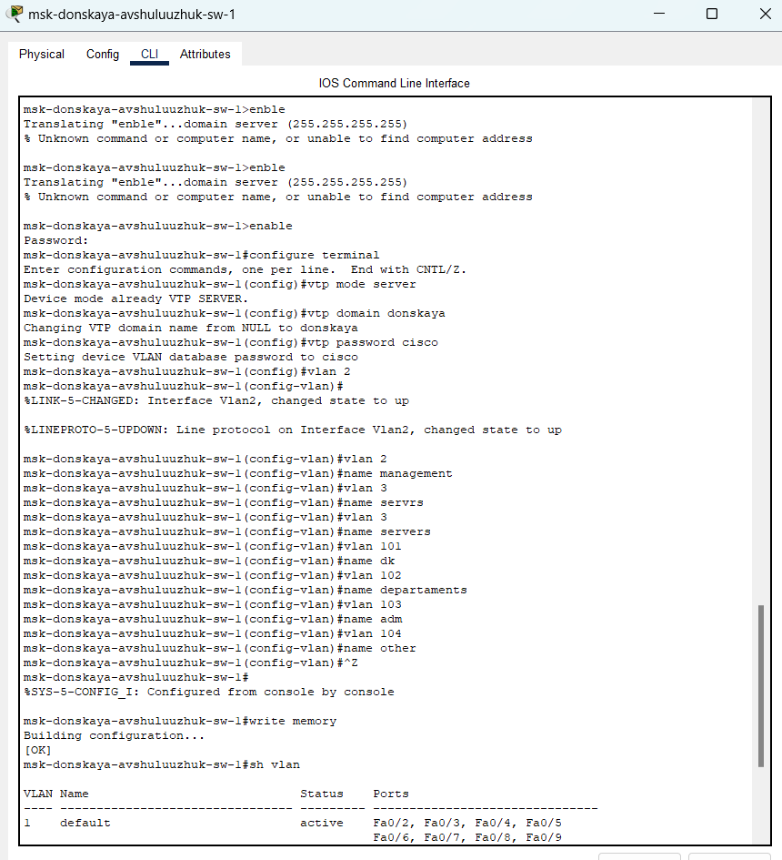{#fig:006 width=70%}

Проведем последовательность команд по конфигурации диапазонов портов, настроем коммутаторы msk-donskaya-sw-2 — msk-
donskaya-sw-4, msk-pavlovskaya-sw-1 как VTP-клиенты и на интерфейсах укажем принадлежность к VLAN (рис. [-@fig:007]) (рис. [-@fig:008]) (рис. [-@fig:009]) (рис. [-@fig:010])

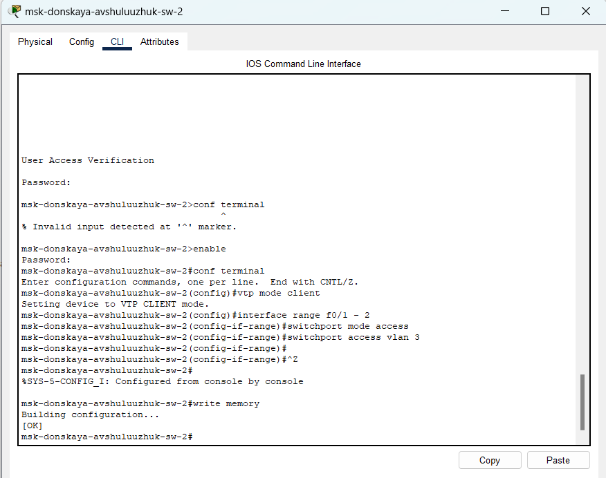{#fig:007 width=70%}

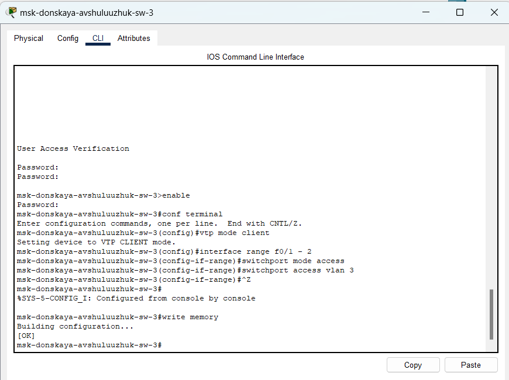{#fig:008 width=70%}

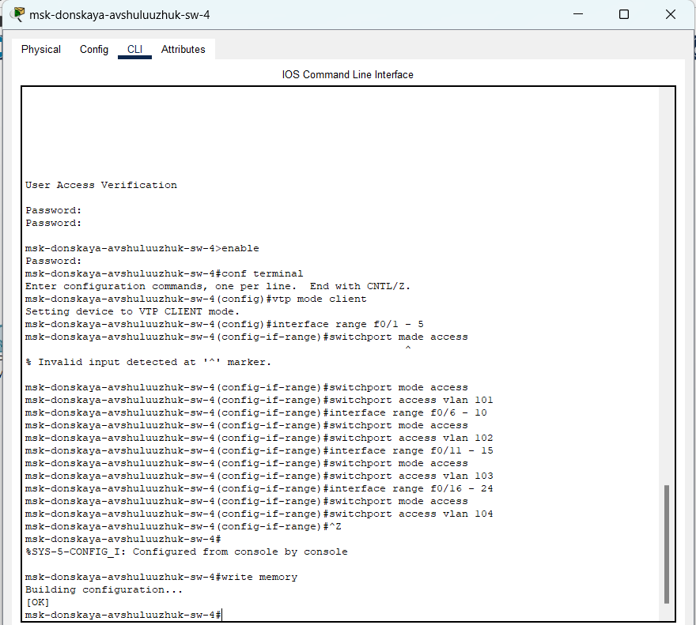{#fig:009 width=70%}

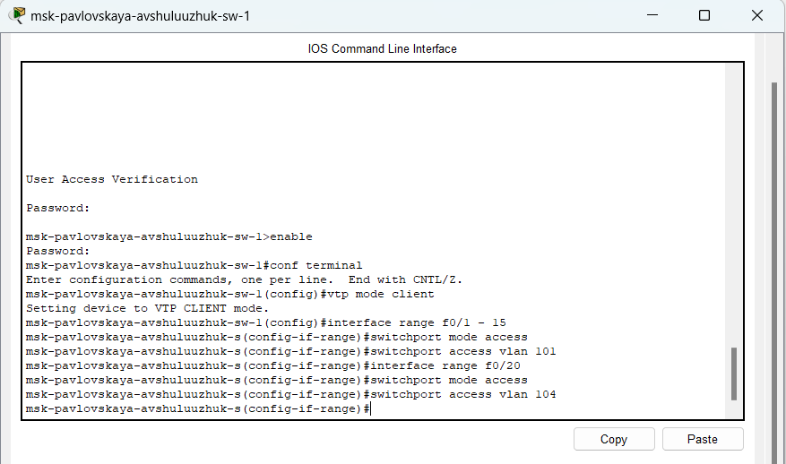{#fig:010 width=70%}

Укажем статические IP-адреса на оконечных устройствах (рис. [-@fig:011]) (рис. [-@fig:012]) (рис. [-@fig:013])

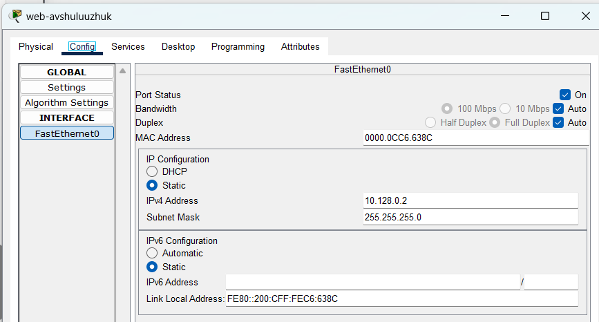{#fig:011 width=70%}

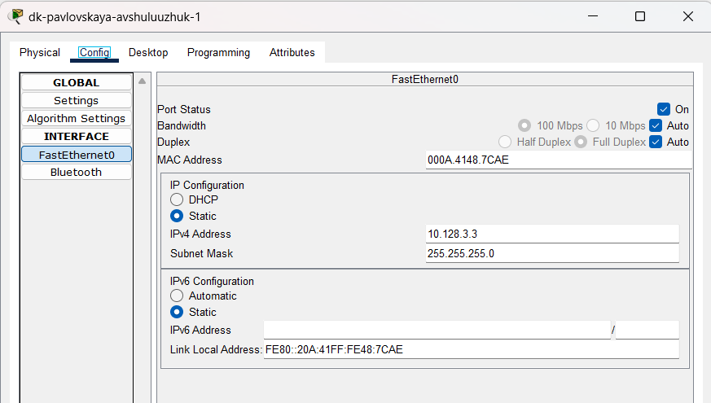{#fig:012 width=70%}

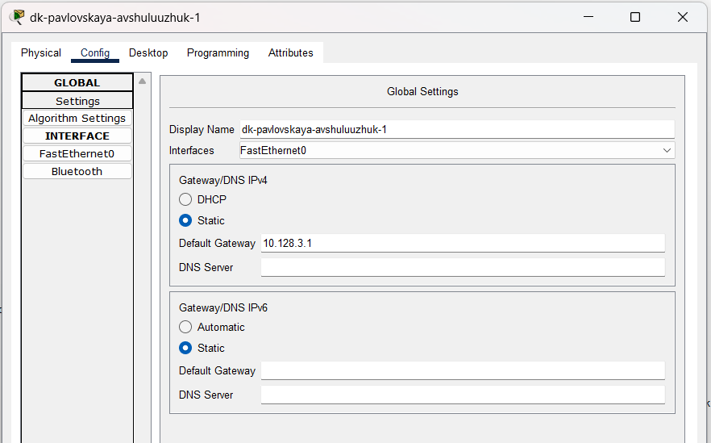{#fig:013 width=70%}

Проверим с помощью команды ping доступность устройств, принадлежащих одному VLAN, и недоступность устройств, принадлежащих разным VLAN (рис. [-@fig:014])

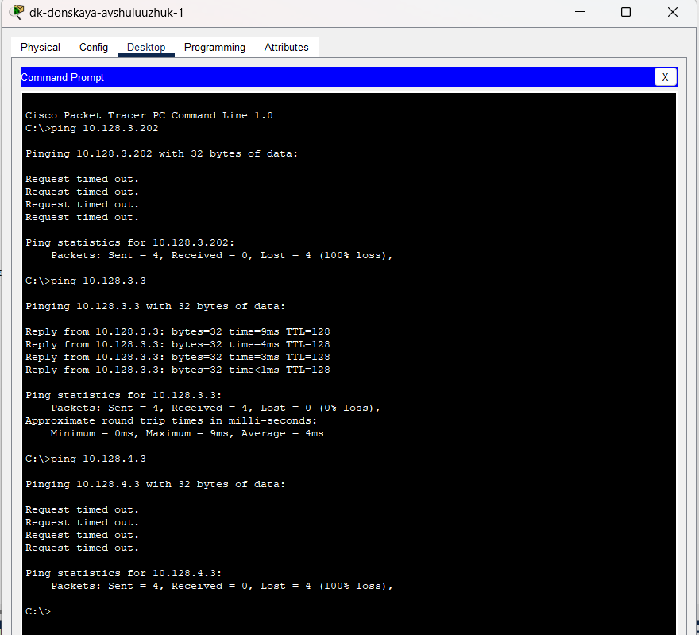{#fig:014 width=70%}

Используя режим симуляции в Packet Tracer, изучим процесс передвижения пакета ICMP по сети (рис. [-@fig:015])

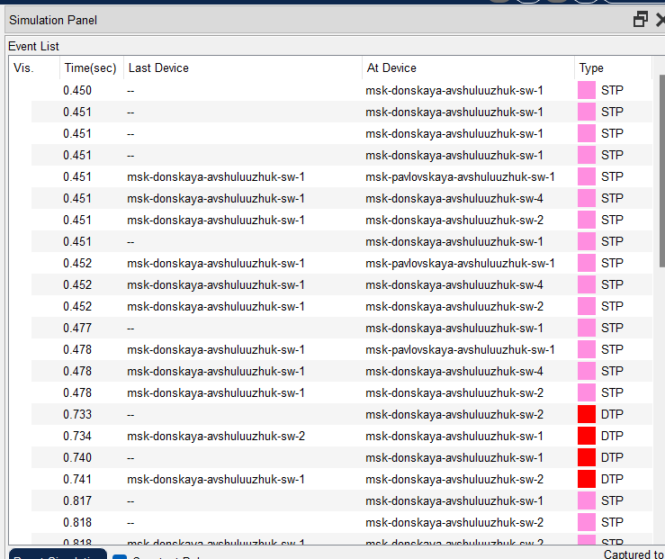{#fig:015 width=70%}

# Выводы

В результате выполнения лабораторной работы были получены основные навыки по настройке VLAN на коммутаторах сети

# Контрольные вопросы

1. Какая команда используется для просмотра списка VLAN на сетевом устройстве?

Ответ: show vlan

2. Охарактеризуйте VLAN Trunking Protocol (VTP). Приведите перечень команд с пояснениями для настройки и просмотра информации о VLAN.

Ответ: VLAN Trunking Protocol (VTP) - это проприетарный протокол Cisco, который позволяет централизованно управлять базами данных VLAN в сети.  Он распространяет информацию о VLAN (добавление, удаление, переименование) по коммутаторам в домене VTP, упрощая администрирование. VTP существует в трех режимах: Server, Client, Transparent.

3. Охарактеризуйте Internet Control Message Protocol (ICMP). Опишите фор-
мат пакета ICMP.

Ответ: Internet Control Message Protocol (ICMP) - это протокол управления и отчетности, используемый сетевыми устройствами, такими как маршрутизаторы и хосты, для отправки сообщений об ошибках и другой информации о состоянии сети. ICMP работает на сетевом уровне (Layer 3) модели OSI и используется в основном протоколом IP. Он не предназначен для передачи пользовательских данных, а служит для диагностики и устранения проблем в сети.  Наиболее известное использование ICMP - команда ping, которая отправляет ICMP Echo Request и ожидает ICMP Echo Reply для проверки доступности хоста.

4. Охарактеризуйте Address Resolution Protocol (ARP). Опишите формат
пакета ARP.

Ответ: Address Resolution Protocol (ARP) - это протокол, используемый для разрешения IP-адресов в MAC-адреса в локальной сети (LAN). Когда хост хочет связаться с другим хостом в той же сети, он знает IP-адрес назначения.  Однако, для отправки фрейма Ethernet, ему необходим MAC-адрес назначения.  ARP позволяет хосту определить MAC-адрес, соответствующий заданному IP-адресу.

5. Что такое MAC-адрес? Какова его структура?

Ответ: Ответ: MAC-адрес (Media Access Control address) - это уникальный идентификатор, присвоенный сетевому адаптеру (Network Interface Card, NIC). Он используется для идентификации устройства в локальной сети. MAC-адрес также называют физическим адресом или аппаратным адресом. Он жестко закодирован в NIC производителем и является уникальным в большинстве случаев.
Структура MAC-адреса: MAC-адрес имеет длину 48 бит (6 байт) и обычно представляется в шестнадцатеричном формате, разделенном двоеточиями или дефисами.  Например: 00:1A:2B:3C:4D:5E или 00-1A-2B-3C-4D-5E.
