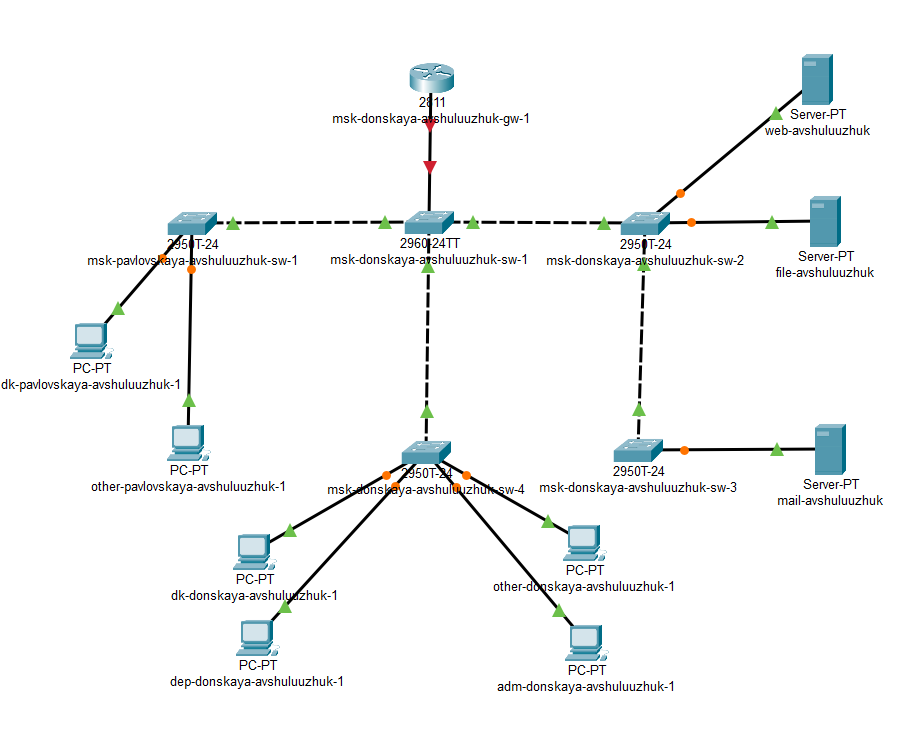
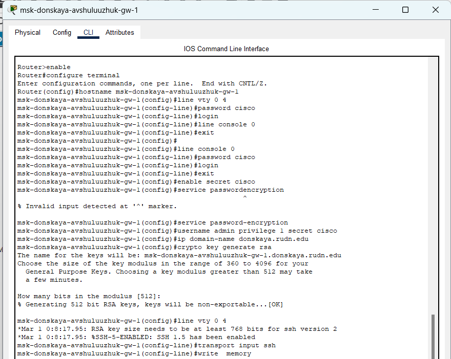
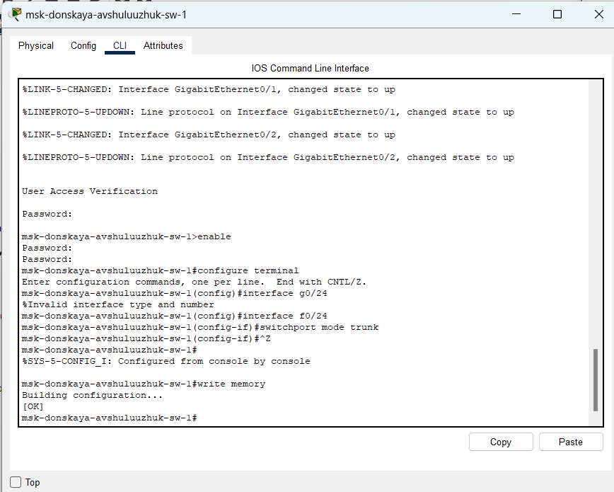
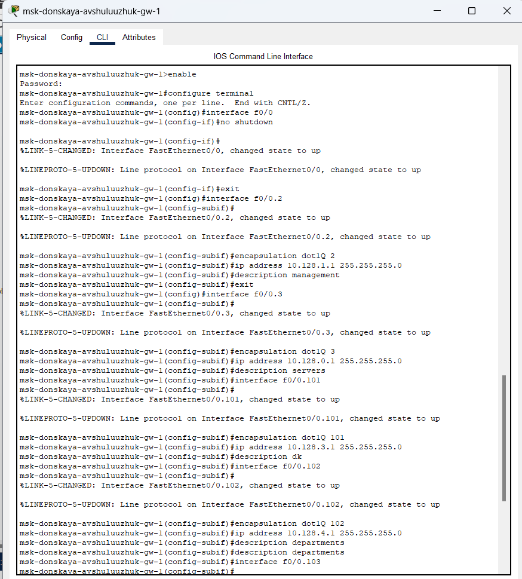
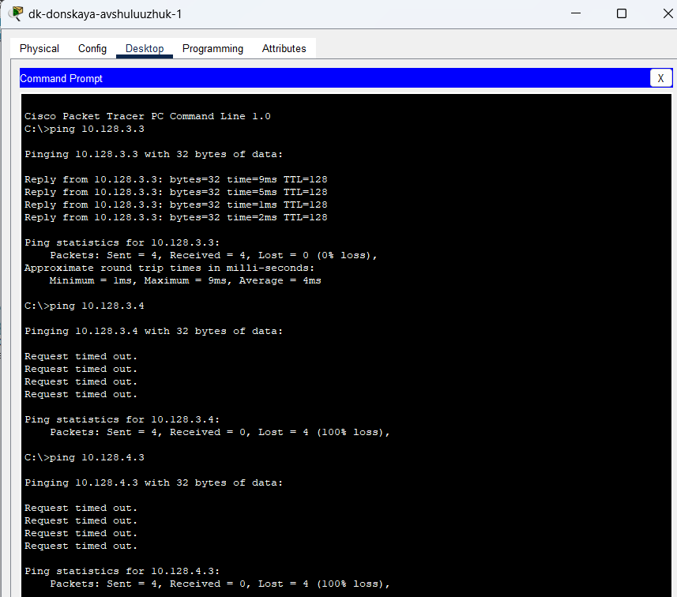
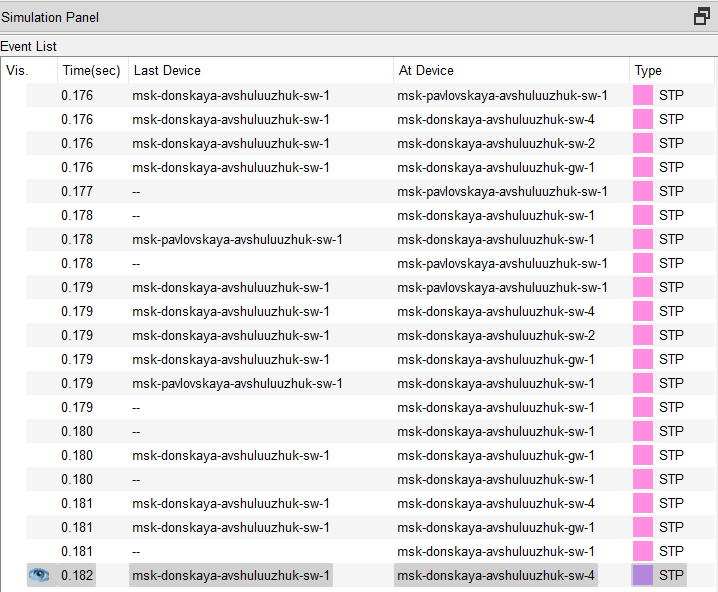

---
## Front matter
title: "Статическая маршрутизация VLAN"
subtitle: "Лабораторная работа  № 6"
author: "Шулуужук Айраана НПИбд-02-22"

## Generic otions
lang: ru-RU
toc-title: "Содержание"

## Bibliography
bibliography: bib/cite.bib
csl: pandoc/csl/gost-r-7-0-5-2008-numeric.csl

## Pdf output format
toc: true # Table of contents
toc-depth: 2
lof: true # List of figures
lot: true # List of tables
fontsize: 12pt
linestretch: 1.5
papersize: a4
documentclass: scrreprt
## I18n polyglossia
polyglossia-lang:
  name: russian
  options:
	- spelling=modern
	- babelshorthands=true
polyglossia-otherlangs:
  name: english
## I18n babel
babel-lang: russian
babel-otherlangs: english
## Fonts
mainfont: IBM Plex Serif
romanfont: IBM Plex Serif
sansfont: IBM Plex Sans
monofont: IBM Plex Mono
mathfont: STIX Two Math
mainfontoptions: Ligatures=Common,Ligatures=TeX,Scale=0.94
romanfontoptions: Ligatures=Common,Ligatures=TeX,Scale=0.94
sansfontoptions: Ligatures=Common,Ligatures=TeX,Scale=MatchLowercase,Scale=0.94
monofontoptions: Scale=MatchLowercase,Scale=0.94,FakeStretch=0.9
mathfontoptions:
## Biblatex
biblatex: true
biblio-style: "gost-numeric"
biblatexoptions:
  - parentracker=true
  - backend=biber
  - hyperref=auto
  - language=auto
  - autolang=other*
  - citestyle=gost-numeric
## Pandoc-crossref LaTeX customization
figureTitle: "Рис."
tableTitle: "Таблица"
listingTitle: "Листинг"
lofTitle: "Список иллюстраций"
lotTitle: "Список таблиц"
lolTitle: "Листинги"
## Misc options
indent: true
header-includes:
  - \usepackage{indentfirst}
  - \usepackage{float} # keep figures where there are in the text
  - \floatplacement{figure}{H} # keep figures where there are in the text
---

# Цель работы

Настроить статическую маршрутизацию VLAN в сети.

# Задание

1. Добавить в локальную сеть маршрутизатор, провести его первоначальную настройку.
2. Настроить статическую маршрутизацию VLAN.
3. При выполнении работы необходимо учитывать соглашение об именовании.
 
# Выполнение лабораторной работы

В логической области проекта разместим маршрутизатор Cisco 2811, подключим его к порту 24 коммутатора msk-donskaya-sw-1 в соответствии с таблицей портов (рис. [-@fig:001])

{#fig:001 width=70%}

Проведем последовательность команд по первоначальной настройке маршрутизатора, сконфигурируем маршрутизатор, задав на нём имя, пароль для доступа к консоли, настроем удалённое подключение к нему по ssh (рис. [-@fig:002])

{#fig:002 width=70%}

Настроем порт 24 коммутатора msk-donskaya-sw-1 как trunk-порт (рис. [-@fig:003])

{#fig:003 width=70%}

На интерфейсе f0/0 маршрутизатора msk-donskaya-gw-1 настроем виртуальные интерфейсы, соответствующие номерам VLAN. Согласно таблице IP-адресов зададим соответствующие IP-адреса на виртуальных интерфейсах. Проведем последовательность команд по конфигурации VLAN-интерфейсов маршрутизатора (рис. [-@fig:004]) 

{#fig:004 width=70%}

Проверим доступность оконечных устройств из разных VLAN (рис. [-@fig:005])

{#fig:005 width=70%}

Используя режим симуляции в Packet Tracer, изучим процесс передвижения пакета по сети. Изучим содержимое передаваемого пакета и заголовки задействованных протоколов (рис. [-@fig:006])

{#fig:006 width=70%}

# Выводы

В результате выполнения лабораторной работы была проведена настройка статической маршрутизации VLAN в сети.

# Контрольные вопросы

1. Охарактеризуйте стандарт IEEE 802.1Q.

Ответ: IEEE 802.1Q - это стандарт IEEE, который определяет виртуальные локальные сети (VLAN) и протокол VLAN Tagging.  Он также известен как VLAN Trunking Protocol (VTP), хотя это название не совсем точное, так как VTP - это протокол Cisco для управления VLAN.

Ключевые характеристики IEEE 802.1Q:
- Позволяет создавать логически разделенные сети (VLAN) в пределах одной физической сети. Это достигается путем добавления тега VLAN к кадрам Ethernet.

- Определяет формат тега VLAN (802.1Q tag), который добавляется между MAC-адресом источника и типом Ethernet протокола.

- Определяет методы для пересылки кадров с тегами VLAN между коммутаторами.

- Поддерживает приоритезацию трафика (Quality of Service - QoS) путем использования полей приоритета в теге VLAN.  Это позволяет назначать разные приоритеты различным типам трафика, например, голосовому трафику (VoIP) или видеоконференциям.

- Определяет концепцию Native VLAN.  Это VLAN, кадры которой отправляются без тегов на trunk-портах.  Это сделано для совместимости со старым оборудованием, которое не поддерживает 802.1Q.

- Определяет протокол Multiple VLAN Registration Protocol (MVRP),  который позволяет динамически распространять информацию о VLAN между коммутаторами.  MVRP заменяет более ранний протокол GVRP (Generic VLAN Registration Protocol).

- Стандарт определяет, как кадры с тегами VLAN должны обрабатываться коммутаторами.  Коммутатор может добавлять, удалять или изменять теги VLAN.

- Позволяет создавать trunk-порты, которые могут передавать трафик нескольких VLAN. Trunk-порты соединяют коммутаторы и позволяют трафику из нескольких VLAN проходить через одно физическое соединение.

- Обеспечивает лучшую безопасность и управление сетью. Разделение сети на VLAN позволяет ограничить широковещательный трафик и улучшить контроль доступа.

2. Опишите формат кадра IEEE 802.1Q.

Ответ: Кадр IEEE 802.1Q  добавляет 4-байтовый тег VLAN в стандартный Ethernet кадр.  Тег вставляется между MAC-адресом источника и полем EtherType/Length.  Вот как выглядит формат кадра 802.1Q

Ключевые моменты:
- TPID (Tag Protocol Identifier): Всегда имеет значение 0x8100, что указывает на то, что в кадре присутствует тег 802.1Q.

- PCP (Priority Code Point): Используется для QoS, позволяет назначить кадру приоритет от 0 до 7.  Более высокие значения указывают на более высокий приоритет.

- CFI (Canonical Format Indicator): Используется для совместимости со старыми сетями Token Ring.  Обычно равен 0 в сетях Ethernet.

- VID (VLAN Identifier): Идентифицирует VLAN, к которой принадлежит кадр.  Может принимать значения от 1 до 4094.  VLAN ID 0 и 4095 зарезервированы.
