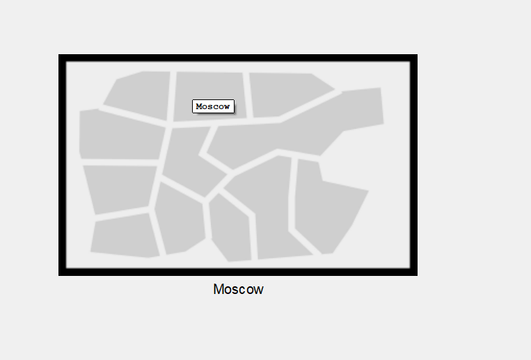
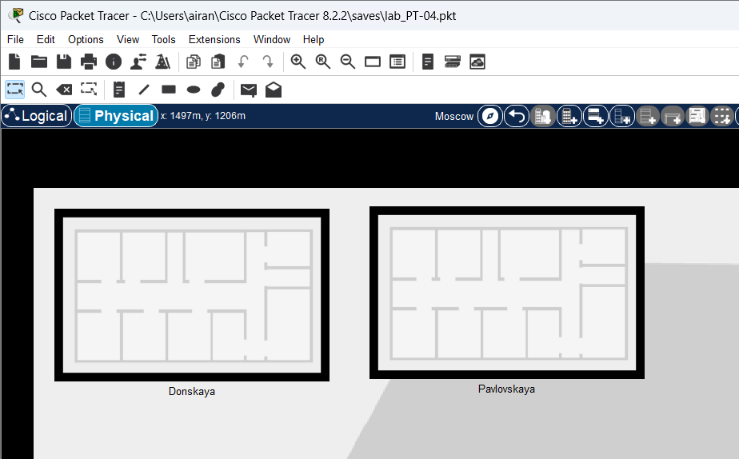
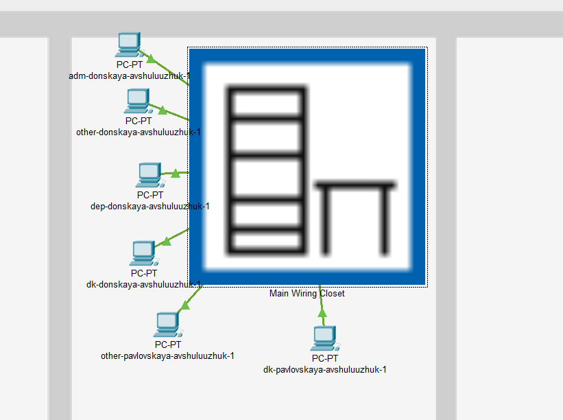
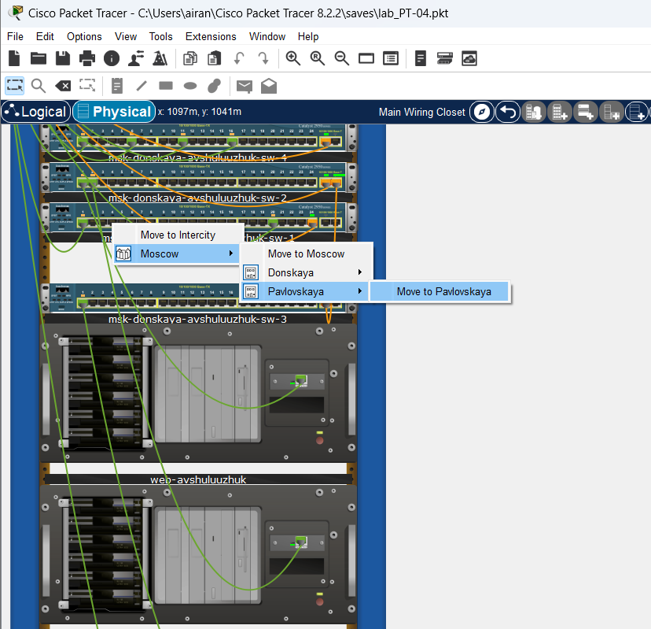
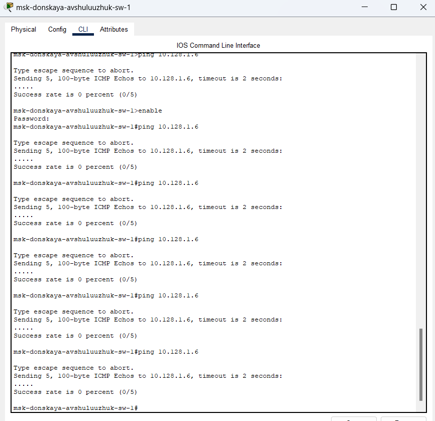
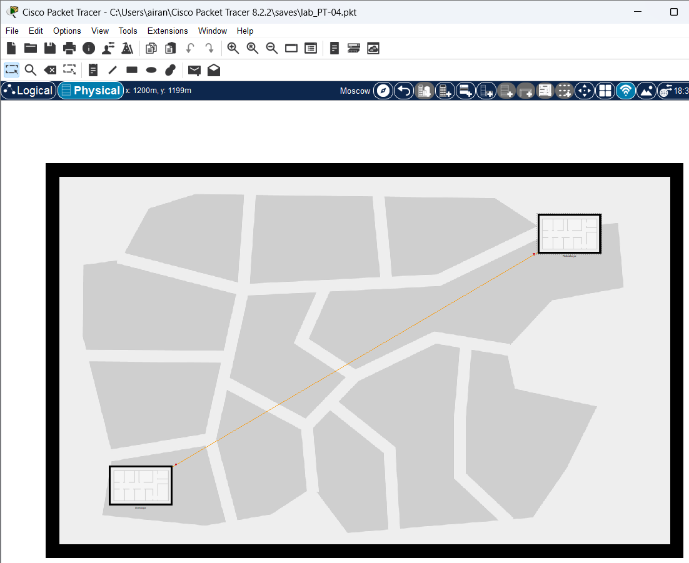
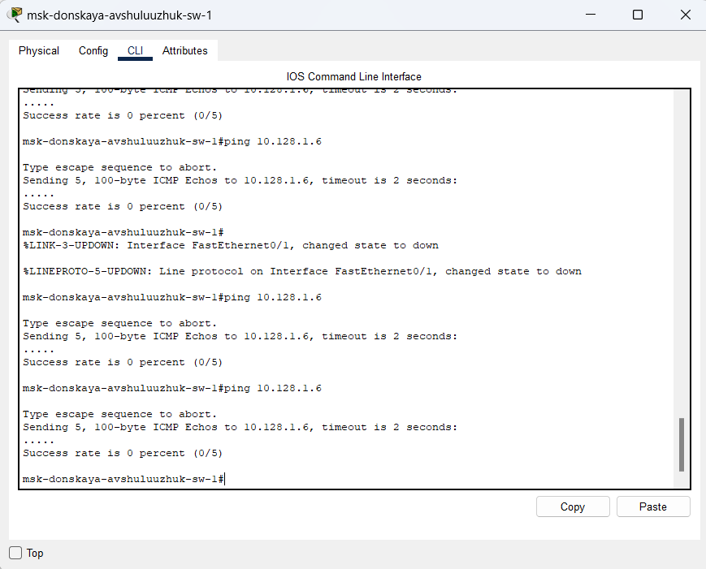
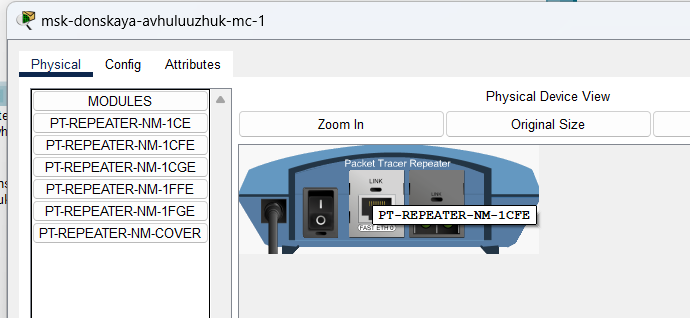
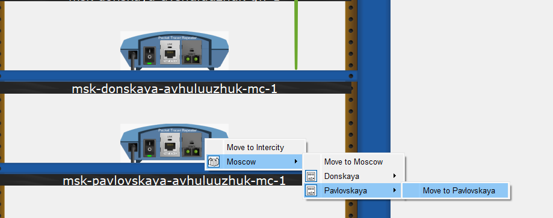
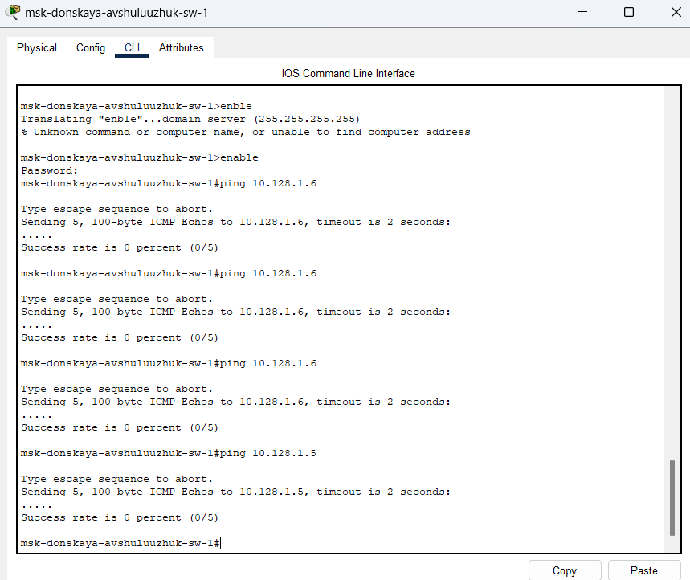

---
## Front matter
title: "Учёт физических параметров сети"
subtitle: "Лабораторная работа  № 7"
author: "Шулуужук Айраана НПИбд-02-22"

## Generic otions
lang: ru-RU
toc-title: "Содержание"

## Bibliography
bibliography: bib/cite.bib
csl: pandoc/csl/gost-r-7-0-5-2008-numeric.csl

## Pdf output format
toc: true # Table of contents
toc-depth: 2
lof: true # List of figures
lot: true # List of tables
fontsize: 12pt
linestretch: 1.5
papersize: a4
documentclass: scrreprt
## I18n polyglossia
polyglossia-lang:
  name: russian
  options:
	- spelling=modern
	- babelshorthands=true
polyglossia-otherlangs:
  name: english
## I18n babel
babel-lang: russian
babel-otherlangs: english
## Fonts
mainfont: IBM Plex Serif
romanfont: IBM Plex Serif
sansfont: IBM Plex Sans
monofont: IBM Plex Mono
mathfont: STIX Two Math
mainfontoptions: Ligatures=Common,Ligatures=TeX,Scale=0.94
romanfontoptions: Ligatures=Common,Ligatures=TeX,Scale=0.94
sansfontoptions: Ligatures=Common,Ligatures=TeX,Scale=MatchLowercase,Scale=0.94
monofontoptions: Scale=MatchLowercase,Scale=0.94,FakeStretch=0.9
mathfontoptions:
## Biblatex
biblatex: true
biblio-style: "gost-numeric"
biblatexoptions:
  - parentracker=true
  - backend=biber
  - hyperref=auto
  - language=auto
  - autolang=other*
  - citestyle=gost-numeric
## Pandoc-crossref LaTeX customization
figureTitle: "Рис."
tableTitle: "Таблица"
listingTitle: "Листинг"
lofTitle: "Список иллюстраций"
lotTitle: "Список таблиц"
lolTitle: "Листинги"
## Misc options
indent: true
header-includes:
  - \usepackage{indentfirst}
  - \usepackage{float} # keep figures where there are in the text
  - \floatplacement{figure}{H} # keep figures where there are in the text
---

# Цель работы

Получить навыки работы с физической рабочей областью Packet Tracer, а также учесть физические параметры сети.

# Задание

Требуется заменить соединение между коммутаторами двух территорий msk-donskaya-sw-1 и msk-pavlovskaya-sw-1 на соединение, учитывающее физические параметры сети, а именно — расстояние между двумя территориями.
 
# Выполнение лабораторной работы

Перейдем в физическую рабочую область Packet Tracer. Присвоим название городу — Moscow (рис. [-@fig:001])

{#fig:001 width=70%}

Щёлкнув на изображении города, увидим изображение здания. Присвоим ему название Donskaya. Добавим здание для территории Pavlovskaya (рис. [-@fig:002])

{#fig:002 width=70%}

Щёлкнув на изображении здания Donskaya, переместим изображение, обозначающее серверное помещение, в него (рис. [-@fig:003])

{#fig:003 width=70%}

Переместим коммутатор msk-pavlovskaya-sw-1 и два оконечных устройства dk-pavlovskaya-1 и other-pavlovskaya-1 на территорию Pavlovskaya, используя меню Move физической рабочей области Packet Tracer (рис. [-@fig:004]) 

{#fig:004 width=70%}

Вернувшись в логическую рабочую область Packet Tracer, пропингуем с коммутатора msk-donskaya-sw-1 коммутатор msk-pavlovskaya-sw-1. Убедимся в неработоспособности соединения (рис. [-@fig:005])

{#fig:005 width=70%}

В меню Options , Preferences во вкладке Interface активируем разрешение на учёт физических характеристик среды передачи (Enable Cable Length Effects) (рис. [-@fig:006])

{#fig:006 width=70%}

В физической рабочей области Packet Tracer разместим две территории на расстояние — около 1000м или более (рис. [-@fig:007])

{#fig:007 width=70%}

Вернувшись в логическую рабочую область Packet Tracer, пропингуем с коммутатора msk-donskaya-sw-1 коммутатор msk-pavlovskaya-sw-1. Убедимся в неработоспособности соединения (рис. [-@fig:008])

{#fig:008 width=70%}

Щёлкнув на изображении здания Donskaya, переместим изображение, обозначающее серверное помещение, в него. Удалим соединение между msk-donskaya-sw-1 и msk-pavlovskaya-sw-1. Добавим в логическую рабочую область два повторителя (Repeater-PT). Присвоим им соответствующие названия msk-donskaya-mc-1 и msk-pavlovskaya-mc-1. Заменим имеющиеся модули на PT-REPEATER-NM-1FFE и PT-REPEATER-NM-1CFE для подключения оптоволокна и витой пары по технологии Fast Etherne (рис. [-@fig:009])

{#fig:009 width=70%}

Переместим msk-pavlovskaya-mc-1 на территорию Pavlovskaya (в физической рабочей области Packet Tracer) (рис. [-@fig:010]) 

{#fig:010 width=70%}

Подключим коммутатор msk-donskaya-sw-1 к msk-donskaya-mc-1 по витой паре, msk-donskaya-mc-1 и msk-pavlovskaya-mc-1 — по оптоволокну, msk-pavlovskaya-sw-1 к msk-pavlovskaya-mc-1 — по витой паре (рис. [-@fig:011])

{#fig:011 width=70%}

Убедимся в неработоспособности соединения между msk-donskaya-sw-1 и msk-pavlovskaya-sw-1 (рис. [-@fig:012])

{#fig:012 width=70%}

# Выводы

В результате выполнения лабораторной работы были получены навыки работы с физической рабочей областью Packet Tracer, а также учесть физические параметры сети.

# Контрольные вопросы

Ответы на вопросы о средах передачи данных:

1. Перечислите возможные среды передачи данных. На какие характеристики среды передачи данных следует обращать внимание при планировании сети?

Возможные среды передачи данных:

Проводные:

Витая пара (Twisted Pair):  UTP (Unshielded Twisted Pair), STP (Shielded Twisted Pair), FTP (Foiled Twisted Pair), S/FTP (Shielded Foiled Twisted Pair).

Коаксиальный кабель (Coaxial Cable): Толстый коаксиал (Thicknet), тонкий коаксиал (Thinnet). (Устаревшие технологии, редко используются в современных сетях).

Оптоволоконный кабель (Fiber Optic Cable): Одномодовый (Single-mode), многомодовый (Multi-mode).

Беспроводные:

Радиоволны (Radio Waves): Wi-Fi (IEEE 802.11), Bluetooth, сотовая связь (3G, 4G, 5G).

Микроволны (Microwaves): Спутниковая связь, радиорелейные линии.

Инфракрасное излучение (Infrared):  (Устаревшая технология, ограничена прямой видимостью и небольшим расстоянием).

Специальные среды:

Акустические сигналы (Acoustic signals): (например, для подводной связи).

Линии электропередач (Power Lines): PLC (Power Line Communication).

Характеристики среды передачи данных, важные при планировании сети:

Пропускная способность (Bandwidth): Максимальная скорость передачи данных, измеряется в битах в секунду (бит/с, кбит/с, Мбит/с, Гбит/с).

Затухание сигнала (Attenuation): Потеря мощности сигнала при передаче на расстояние.  Влияет на максимальную длину сегмента сети без повторителей.

Помехоустойчивость (Noise Immunity):  Способность противостоять внешним помехам (электромагнитным, радиочастотным).  Влияет на стабильность и надежность передачи данных.

Безопасность (Security): Уязвимость к перехвату данных. Проводные среды, как правило, более безопасны, чем беспроводные.

Стоимость (Cost): Стоимость кабеля, оборудования и монтажа.

Расстояние (Distance): Максимальное расстояние, на которое можно передавать данные без усиления сигнала.

Мобильность (Mobility): Возможность перемещения устройств во время передачи данных (актуально для беспроводных сетей).

Масштабируемость (Scalability): Легкость добавления новых устройств или увеличения пропускной способности сети.

Надежность (Reliability):  Вероятность сбоев и время восстановления после сбоев.

Электромагнитная совместимость (EMC):  Способность оборудования не создавать помех для других устройств и не подвергаться их воздействию.

Размер и вес (Size and weight): Важно для прокладки в ограниченном пространстве.

2. Перечислите категории витой пары. Чем они отличаются? Какая категория в каких условиях может применяться?

Категории витой пары:

Cat3:  Максимальная частота 16 МГц, скорость до 10 Мбит/с.  Использовалась для телефонной связи и устаревших сетей Ethernet (10BASE-T). Практически не используется в современных сетях.

Cat5:  Максимальная частота 100 МГц, скорость до 100 Мбит/с. Использовалась для Ethernet (100BASE-TX).  Устарела, но иногда встречается.

Cat5e (Enhanced): Максимальная частота 100 МГц, скорость до 1000 Мбит/с (1 Гбит/с). Улучшенная версия Cat5 с меньшим уровнем помех.  Подходит для Gigabit Ethernet (1000BASE-T) на коротких расстояниях. Все еще широко используется в существующих сетях.

Cat6: Максимальная частота 250 МГц, скорость до 1000 Мбит/с (1 Гбит/с), возможно 10 Гбит/с на коротких расстояниях (до 55 метров).  Более жесткие требования к параметрам, чем Cat5e. Рекомендуется для новых установок Gigabit Ethernet и 10 Gigabit Ethernet (на коротких расстояниях).

Cat6a (Augmented): Максимальная частота 500 МГц, скорость до 10 Гбит/с на расстоянии до 100 метров.  Улучшенная версия Cat6 с лучшей защитой от помех. Рекомендуется для новых установок 10 Gigabit Ethernet.

Cat7: Максимальная частота 600 МГц, скорость до 10 Гбит/с на расстоянии до 100 метров.  Имеет более строгие требования к экранированию, чем Cat6a.

Cat7a (Augmented): Максимальная частота 1000 МГц, скорость до 10 Гбит/с на расстоянии до 100 метров.  Дальнейшее улучшение экранирования и производительности.

Cat8: Максимальная частота до 2000 МГц, скорость до 40 Гбит/с на коротких расстояниях (до 30 метров).  Разработана для центров обработки данных (ЦОД) и других приложений с высокой пропускной способностью.

Отличия категорий:

Основное отличие - полоса пропускания (частота).  Чем выше категория, тем выше поддерживаемая частота и, как следствие, выше скорость передачи данных. Также, более высокие категории обычно имеют лучшее экранирование, что обеспечивает лучшую помехоустойчивость и позволяет передавать данные на большее расстояние без потери качества.

Применение:

Cat3:  Устарела.  Не рекомендуется для новых установок.

Cat5: Устарела. Не рекомендуется для новых установок.

Cat5e: Подходит для модернизации существующих сетей Gigabit Ethernet, где важна стоимость.

Cat6:  Рекомендуется для новых установок Gigabit Ethernet и 10 Gigabit Ethernet на коротких расстояниях.

Cat6a: Рекомендуется для новых установок 10 Gigabit Ethernet на расстояниях до 100 метров.

Cat7/Cat7a:  Используется в специальных приложениях, требующих высокой помехоустойчивости и защиты данных.

Cat8: Используется в ЦОД и других приложениях с очень высокой пропускной способностью.

При выборе категории витой пары необходимо учитывать текущие и будущие потребности в пропускной способности сети, а также бюджет.  Рекомендуется выбирать категорию с запасом по пропускной способности, чтобы обеспечить долгосрочную работоспособность сети.

3. В чем отличие одномодового и многомодового оптоволокна? Какой тип кабеля в каких условиях может применяться?

Отличия одномодового и многомодового оптоволокна:

Диаметр сердцевины:  Одномодовое оптоволокно имеет очень малый диаметр сердцевины (около 9 микрон), что позволяет передавать только один луч света (один "мод").  Многомодовое оптоволокно имеет больший диаметр сердцевины (50 или 62.5 микрон), что позволяет передавать несколько лучей света одновременно (несколько "мод").

Рассеяние сигнала (Dispersion): В многомодовом волокне происходит модовая дисперсия, когда разные лучи света проходят разные расстояния внутри волокна, что приводит к размытию сигнала на больших расстояниях. В одномодовом волокне дисперсия значительно меньше, так как передается только один луч.

Дальность передачи:  Одномодовое оптоволокно позволяет передавать данные на гораздо большие расстояния (десятки и сотни километров) без потери качества сигнала, чем многомодовое (обычно до нескольких километров).

Стоимость:  Одномодовое оптоволокно и оборудование для него (трансиверы) обычно дороже, чем многомодовое.

Применение:

Одномодовое оптоволокно:

Магистральные сети связи (Backbone):  Используется для соединения зданий, городов и стран на больших расстояниях.

Интернет-провайдеры (ISP): Для предоставления услуг связи на большие расстояния.

Телекоммуникационные сети: Для передачи данных на большие расстояния.

Внутри ЦОД для очень дальних соединений.

Многомодовое оптоволокно:

Локальные сети (LAN):  Используется для соединения компьютеров, серверов и другого оборудования в пределах одного здания или кампуса.

ЦОД (Data Centers):  Используется для соединения серверов, систем хранения данных и сетевого оборудования на относительно коротких расстояниях.

Внутри зданий:  Для соединения этажей или разных частей здания.

Приложения, требующие высокой пропускной способности на коротких расстояниях.

В каких условиях какой тип кабеля применять:

Большие расстояния (более нескольких километров): Однозначно одномодовое оптоволокно.

Ограниченный бюджет: Многомодовое оптоволокно может быть более экономичным решением на коротких расстояниях.

Высокая пропускная способность на коротких расстояниях:  Многомодовое оптоволокно с использованием современных технологий (например, OM4, OM5) может обеспечить очень высокую пропускную способность.

Существующая инфраструктура: Если уже проложена многомодовая кабельная система, может быть экономически целесообразно использовать многомодовое оборудование.

При выборе типа оптоволокна необходимо учитывать требования к дальности передачи, пропускной способности, бюджету и существующей инфраструктуре.

4. Какие разъёмы встречаются на патчах оптоволокна? Чем они отличаются?

Наиболее распространенные типы разъемов на оптоволоконных патч-кордах:

LC (Lucent Connector):  Маленький форм-фактор (SFF), наиболее распространенный тип разъема для современных сетей.  Имеет защелку. Доступен в дуплексном варианте (два разъема в одном корпусе).  Используется как для одномодового, так и для многомодового волокна.

SC (Subscriber Connector):  Более крупный, чем LC.  Имеет прямоугольную форму и защелку.  Доступен в дуплексном варианте.  Ранее был широко распространен, но сейчас постепенно вытесняется LC. Используется как для одномодового, так и для многомодового волокна.

ST (Straight Tip):  Круглый разъем с байонетным соединением (штыковой замок).  Устаревший тип разъема, редко используется в современных сетях. Используется как для одномодового, так и для многомодового волокна.

FC (Ferrule Connector):  Круглый разъем с резьбовым соединением.  Используется в основном для одномодового волокна в телекоммуникационных сетях и измерительном оборудовании.  Обеспечивает высокую точность и надежность соединения.

MTRJ (Mechanical Transfer Registered Jack):  Двухволоконный разъем малого размера.  Редко используется в современных сетях.

MPO/MTP (Multi-fiber Push On/Mechanical Transfer Push On):  Многоволоконные разъемы, используются для подключения нескольких волокон одновременно (обычно 12, 24 или 32 волокна).  Широко используются в ЦОД для высокой плотности соединений.

Отличия разъемов:

Размер и форма:  Разъемы отличаются по размеру и форме, что влияет на плотность размещения портов на оборудовании.

Механизм фиксации: Разъемы используют разные механизмы фиксации (защелка, байонетное соединение, резьбовое соединение), что влияет на удобство подключения и надежность соединения.

Количество волокон:  Большинство разъемов предназначены для подключения одного или двух волокон, а MPO/MTP - для подключения нескольких волокон одновременно.

Тип волокна: Некоторые разъемы больше подходят для одномодового или многомодового волокна.  LC, SC используются для обоих типов.

Области применения:  Разные типы разъемов исторически использовались в разных областях (например, FC - в телекоммуникациях).

При выборе разъема для оптоволоконного патч-корда необходимо учитывать тип оборудования, к которому он будет подключаться, требования к плотности соединений, тип используемого оптоволокна и предпочтения по удобству подключения и надежности соединения.  В современных сетях наиболее распространенным является разъем LC.
