---
## Front matter
title: "Использование протокола STP. Агрегирование каналов"
subtitle: "Лабораторная работа  № 9"
author: "Шулуужук Айраана НПИбд-02-22"

## Generic otions
lang: ru-RU
toc-title: "Содержание"

## Bibliography
bibliography: bib/cite.bib
csl: pandoc/csl/gost-r-7-0-5-2008-numeric.csl

## Pdf output format
toc: true # Table of contents
toc-depth: 2
lof: true # List of figures
lot: true # List of tables
fontsize: 12pt
linestretch: 1.5
papersize: a4
documentclass: scrreprt
## I18n polyglossia
polyglossia-lang:
  name: russian
  options:
	- spelling=modern
	- babelshorthands=true
polyglossia-otherlangs:
  name: english
## I18n babel
babel-lang: russian
babel-otherlangs: english
## Fonts
mainfont: IBM Plex Serif
romanfont: IBM Plex Serif
sansfont: IBM Plex Sans
monofont: IBM Plex Mono
mathfont: STIX Two Math
mainfontoptions: Ligatures=Common,Ligatures=TeX,Scale=0.94
romanfontoptions: Ligatures=Common,Ligatures=TeX,Scale=0.94
sansfontoptions: Ligatures=Common,Ligatures=TeX,Scale=MatchLowercase,Scale=0.94
monofontoptions: Scale=MatchLowercase,Scale=0.94,FakeStretch=0.9
mathfontoptions:
## Biblatex
biblatex: true
biblio-style: "gost-numeric"
biblatexoptions:
  - parentracker=true
  - backend=biber
  - hyperref=auto
  - language=auto
  - autolang=other*
  - citestyle=gost-numeric
## Pandoc-crossref LaTeX customization
figureTitle: "Рис."
tableTitle: "Таблица"
listingTitle: "Листинг"
lofTitle: "Список иллюстраций"
lotTitle: "Список таблиц"
lolTitle: "Листинги"
## Misc options
indent: true
header-includes:
  - \usepackage{indentfirst}
  - \usepackage{float} # keep figures where there are in the text
  - \floatplacement{figure}{H} # keep figures where there are in the text
---

# Цель работы

Изучение возможностей протокола STP и его модификаций по обеспечению отказоустойчивости сети, агрегированию интерфейсов и перераспределению нагрузки между ними.

# Задание

1. Сформируйте резервное соединение между коммутаторами msk-donskaya-sw-1 и msk-donskaya-sw-3.
2. Настройте балансировку нагрузки между резервными соединениями.
3. Настройте режим Portfast на тех интерфейсах коммутаторов, к которым подключены серверы.
4. Изучите отказоустойчивость резервного соединения.
5. Сформируйте и настройте агрегированное соединение интерфейсов Fa0/20 – Fa0/23 между коммутаторами msk-donskaya-sw-1 и msk-donskaya-sw-4.
6. При выполнении работы необходимо учитывать соглашение об именовании.
 
# Выполнение лабораторной работы

Сформируем резервное соединение между коммутаторами msk-donskaya-sw-1 и msk-donskaya-sw-3. Для этого заменим соединение между коммутаторами msk-donskaya-sw-1 (Gig0/2) и msk-donskaya-sw-4 (Gig0/1) на соединение между коммутаторами msk-donskaya-sw-1 (Gig0/2) и msk-donskaya-sw-3 (Gig0/2) (рис. [-@fig:001])

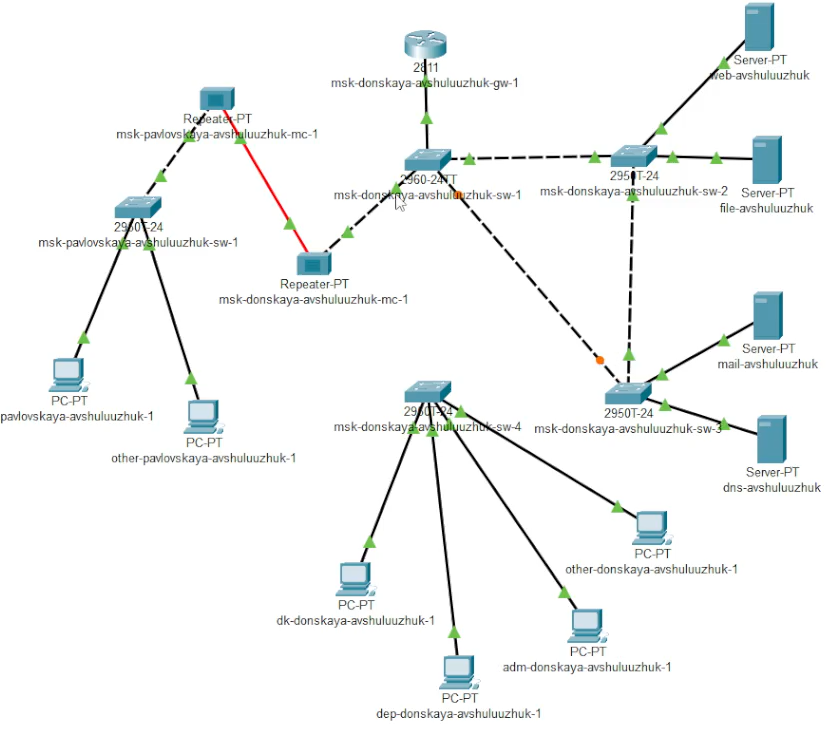{#fig:001 width=70%}

Сделаем порт на интерфейсе Gig0/2 коммутатора msk-donskaya-sw-3 транковым (рис. [-@fig:002])

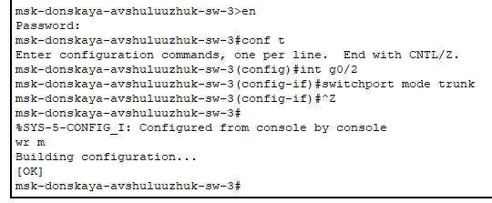{#fig:002 width=70%}

Соединение между коммутаторами msk-donskaya-sw-1 и msk-donskaya-sw-4 сделаем через интерфейсы Fa0/23, не забыв активировать их в транковом режиме (рис. [-@fig:003]) (рис. [-@fig:004])

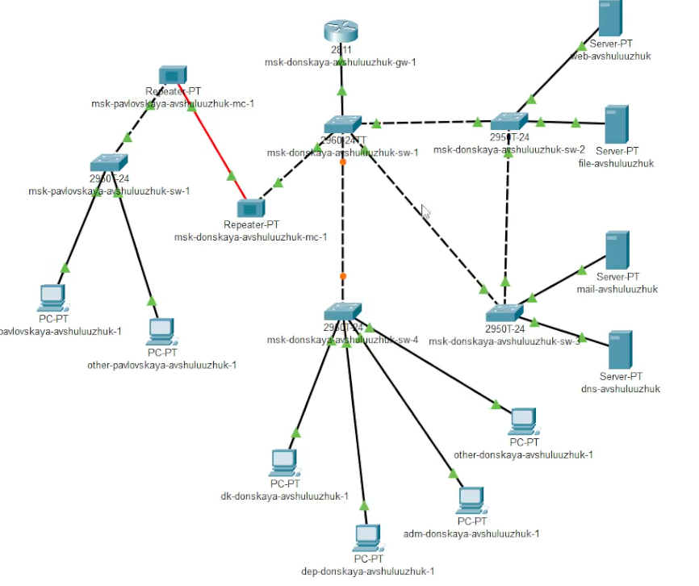{#fig:003 width=70%}

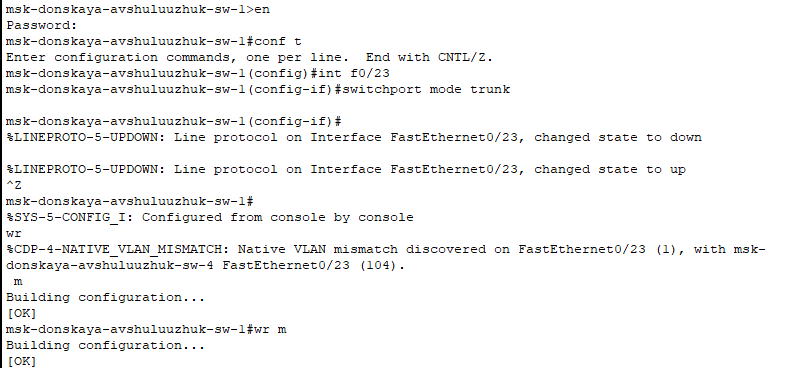{#fig:004 width=70%}

С оконечного устройства dk-donskaya-1 пропингуем серверы mail и web. В режиме симуляции проследите движение пакетов ICMP (рис. [-@fig:005])

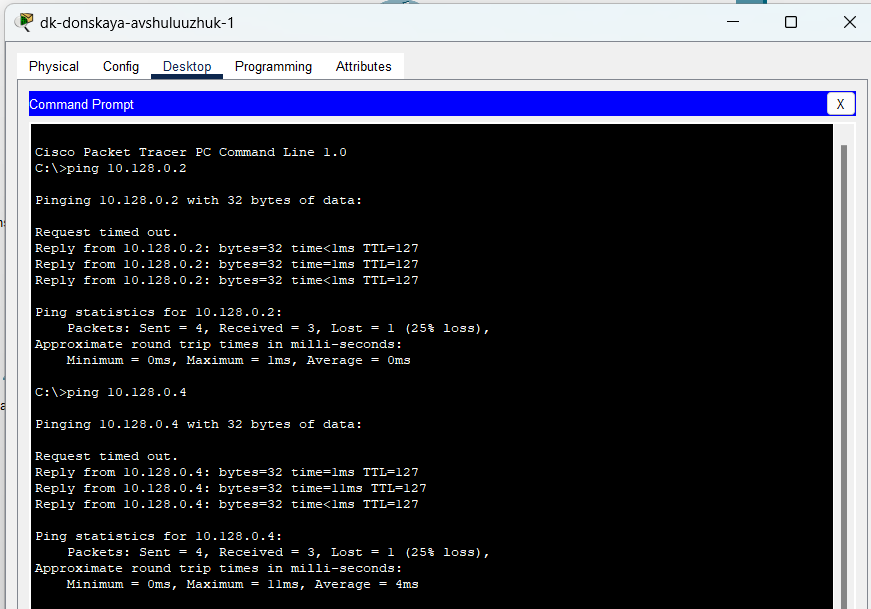{#fig:005 width=70%}

Убедимся, что движение пакетов происходит через коммутатор msk-donskaya-sw-2 (рис. [-@fig:006])

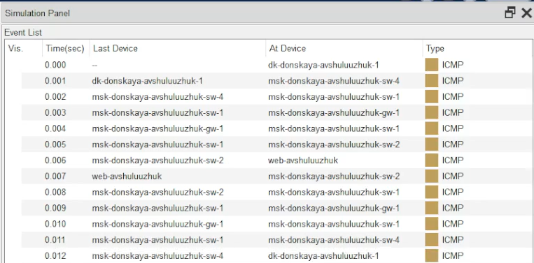{#fig:006 width=70%}

На коммутаторе msk-donskaya-sw-2 посмотрим состояние протокола STP для vlan 3 (рис. [-@fig:007])

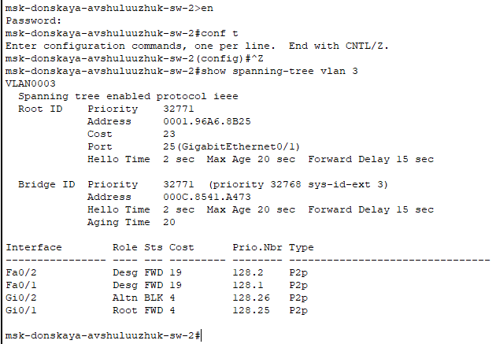{#fig:007 width=70%}

В качестве корневого коммутатора STP настроем коммутатор msk-donskaya-sw-1 (рис. [-@fig:008])

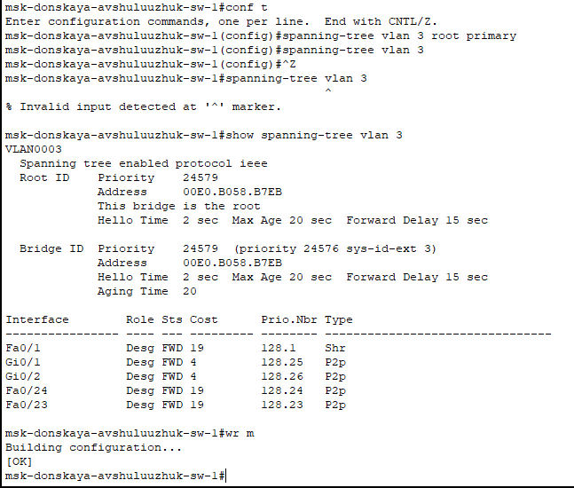{#fig:008 width=70%}

Используя режим симуляции, убедимся, что пакеты ICMP пойдут от хоста dk-donskaya-1 до mail через коммутаторы msk-donskaya-sw-1 и msk-donskaya-sw-3 (рис. [-@fig:009])

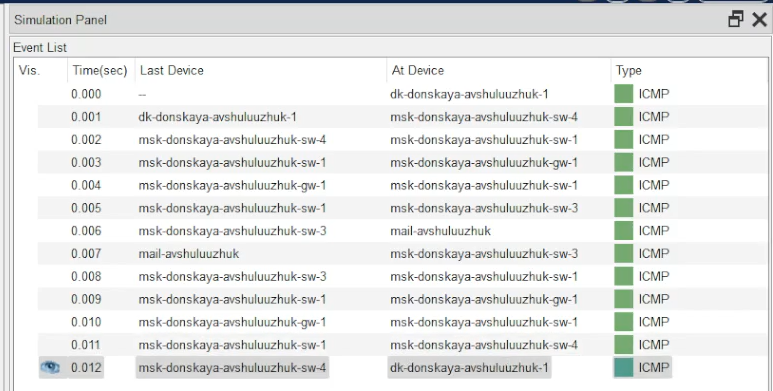{#fig:009 width=70%}

От хоста dk-donskaya-1 до web через коммутаторы msk-donskaya-sw-1 и msk-donskaya-sw-2 (рис. [-@fig:010])

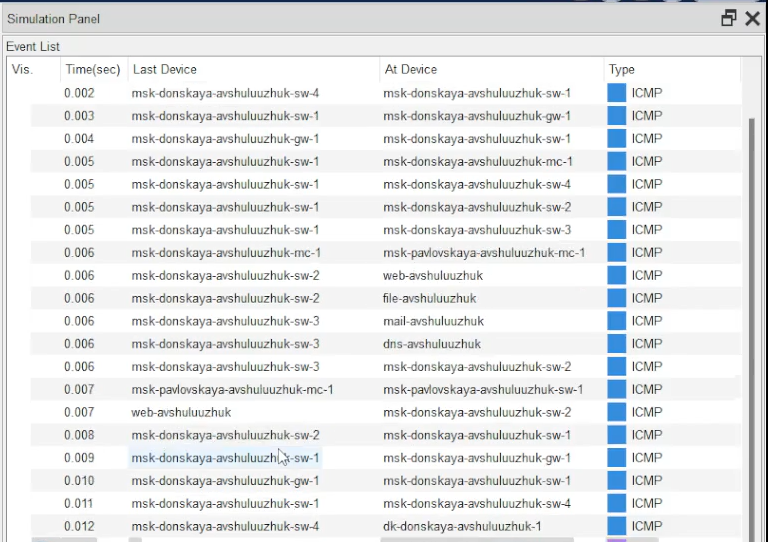{#fig:010 width=70%}

Настроем режим Portfast на тех интерфейсах коммутаторов, к которым подключены серверы (рис. [-@fig:011]) (рис. [-@fig:012])

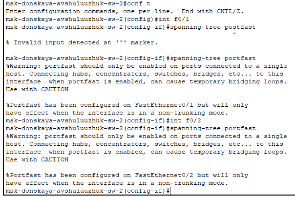{#fig:011 width=70%}

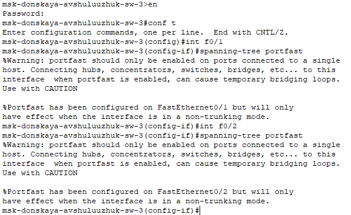{#fig:012 width=70%}

Изучим отказоустойчивость протокола STP и время восстановления соединения при переключении на резервное соединение. Для этого используем команду ping -n 1000 mail.donskaya.rudn.ru на хосте dk-donskaya-1 (рис. [-@fig:013])

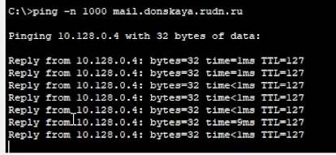{#fig:013 width=70%}

Разрыв соединения обеспечим переводом соответствующего интерфейса коммутатора в состояние shutdown (рис. [-@fig:014]) (рис. [-@fig:015]) 

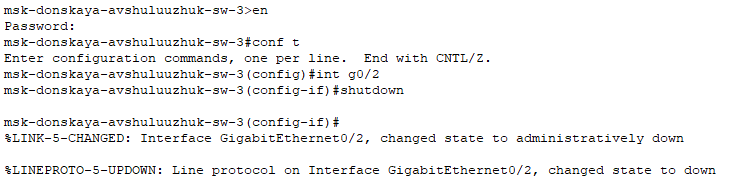{#fig:014 width=70%}

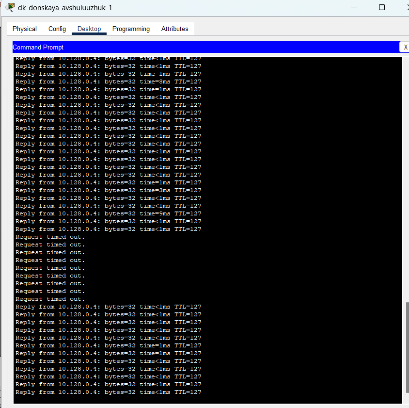{#fig:015 width=70%}

Переключим коммутаторы режим работы по протоколу Rapid PVST+ (рис. [-@fig:016])

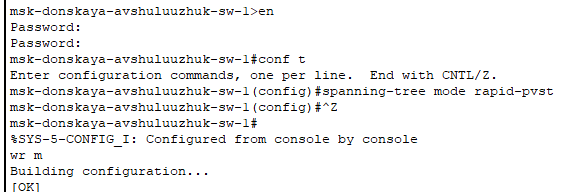{#fig:016 width=70%}

Сформируем агрегированное соединение интерфейсов Fa0/20 – Fa0/23 между коммутаторами msk-donskaya-sw-1 и msk-donskaya-sw-4 (рис. [-@fig:017])

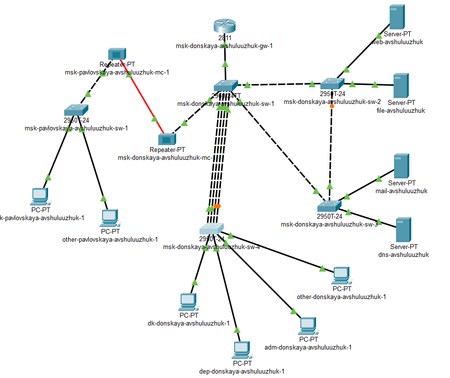{#fig:017 width=70%}

Настройем агрегирование каналов (режим EtherChannel) (рис. [-@fig:018])

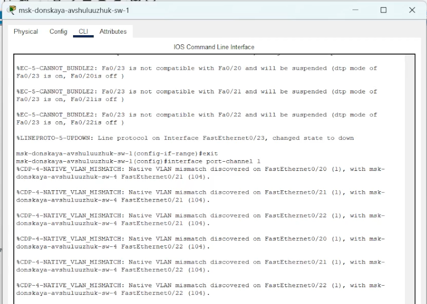{#fig:018 width=70%}

# Выводы

В результате выполнения лабораторной работы было произведено изучение возможностей протокола STP и его модификаций по обеспечению отказоустойчивости сети, агрегированию интерфейсов и перераспределению нагрузки между ними.

# Контрольные вопросы

1. Какую информацию можно получить, воспользовавшись командой определения состояния протокола STP для VLAN (на корневом и не на корневом устройстве)? Приведите примеры вывода подобной информации на устрой-
ствах.

Ответ: Команда для просмотра состояния STP, как правило, выглядит как show spanning-tree vlan <номер_VLAN>. Она предоставляет массу информации, которая различается в зависимости от того, является ли устройство корневым для данной VLAN.

2. При помощи какой команды можно узнать, в каком режиме, STP или Rapid PVST+, работает устройство? Приведите примеры вывода подобной информации на устройствах.

Ответ: Команда обычно выглядит как show spanning-tree summary. Она покажет глобальную информацию о STP, включая используемый режим.

Пример вывода (Cisco):

Switch# show spanning-tree summary
Switch is in pvst mode
Root bridge for: none

3. Для чего и в каких случаях нужно настраивать режим Portfast?

Ответ: Portfast используется для портов, подключенных к конечным устройствам (например, компьютерам, серверам, принтерам), а не к другим коммутаторам.

    Назначение: Portfast позволяет порту немедленно переходить в состояние forwarding, минуя стадии Listening и Learning. Это значительно сокращает время, необходимое устройству для получения доступа к сети после подключения.

    Когда использовать:

        Для портов, к которым подключены только конечные устройства.  Крайне важно не включать Portfast на портах, соединенных с другими коммутаторами, так как это может привести к образованию петель в сети и вызвать широковещательный шторм.

        Для серверов, требующих быстрого доступа к сети после перезагрузки.

        Для VoIP-телефонов.

4. В чем состоит принцип работы агрегированного интерфейса? Для чего он используется?

Ответ: Агрегированный интерфейс (EtherChannel, Link Aggregation) объединяет несколько физических интерфейсов в один логический.

    Принцип работы:  Трафик распределяется между физическими интерфейсами в агрегированном канале на основе определенного алгоритма (например, по MAC-адресам, IP-адресам, портам). Все физические интерфейсы рассматриваются как один логический линк.

    Для чего используется:

        Увеличение пропускной способности:  Объединяя несколько каналов, увеличивается общая пропускная способность соединения.

        Обеспечение избыточности:  Если один из физических интерфейсов выходит из строя, трафик автоматически перенаправляется на другие интерфейсы в группе, обеспечивая непрерывность соединения.

        Упрощение управления:  Агрегированный интерфейс управляется как один логический интерфейс, упрощая конфигурацию и мониторинг.

5. В чём принципиальные отличия при использовании протоколов LACP (Link Aggregation Control Protocol), PAgP (Port Aggregation Protocol) и статического агрегирования без использования протоколов?

Ответ: 
    LACP (Link Aggregation Control Protocol - IEEE 802.3ad):

        Стандартизированный протокол для автоматического согласования и управления агрегированными каналами.

        Позволяет динамически добавлять и удалять интерфейсы из агрегированного канала.

        Проверяет совместимость параметров интерфейсов (скорость, duplex) перед добавлением в канал.

        Обеспечивает обнаружение ошибок конфигурации.

        Рекомендуется для использования, если поддерживается обеими сторонами.

    PAgP (Port Aggregation Protocol - Cisco proprietary):

        Проприетарный протокол Cisco, выполняющий те же функции, что и LACP.

        Работает аналогично LACP, но предназначен для использования в сетях, состоящих из оборудования Cisco.

        Менее предпочтителен, чем LACP, если есть возможность использовать LACP.

    Статическое агрегирование (без протоколов):

        Агрегирование настраивается вручную, без использования протоколов согласования.

        Требует ручной настройки на обоих концах соединения.

        Не обеспечивает автоматического обнаружения ошибок конфигурации или сбоев.

        Менее гибкое и отказоустойчивое, чем LACP или PAgP.  Следует использовать только в том случае, если LACP или PAgP не поддерживаются.

        В случае ошибки конфигурации возможно образование петель.

6. При помощи каких команд можно узнать состояние агрегированного канала EtherChannel?

Ответ: Для просмотра состояния EtherChannel используются различные команды, зависящие от производителя оборудования. Вот примеры для Cisco:

    show etherchannel summary:  Показывает общую информацию о настроенных EtherChannel, включая их состояние и участвующие интерфейсы.

    show etherchannel port-channel:  Отображает информацию о логическом интерфейсе Port-Channel (например, Port-Channel1).  Включает информацию о протоколе (LACP, PAgP) и агрегированных портах.

    show etherchannel port-channel <номер_канала> detail:  Предоставляет подробную информацию о конкретном канале EtherChannel, включая статус каждого порта, параметры протокола и статистику.

    show interface port-channel <номер_канала>:  Показывает информацию об интерфейсе Port-Channel как о логическом интерфейсе (например, IP-адрес, состояние).

