---
## Front matter
title: "Настройка списков управления доступом (ACL)"
subtitle: "Лабораторная работа  № 10"
author: "Шулуужук Айраана НПИбд-02-22"

## Generic otions
lang: ru-RU
toc-title: "Содержание"

## Bibliography
bibliography: bib/cite.bib
csl: pandoc/csl/gost-r-7-0-5-2008-numeric.csl

## Pdf output format
toc: true # Table of contents
toc-depth: 2
lof: true # List of figures
lot: true # List of tables
fontsize: 12pt
linestretch: 1.5
papersize: a4
documentclass: scrreprt
## I18n polyglossia
polyglossia-lang:
  name: russian
  options:
	- spelling=modern
	- babelshorthands=true
polyglossia-otherlangs:
  name: english
## I18n babel
babel-lang: russian
babel-otherlangs: english
## Fonts
mainfont: IBM Plex Serif
romanfont: IBM Plex Serif
sansfont: IBM Plex Sans
monofont: IBM Plex Mono
mathfont: STIX Two Math
mainfontoptions: Ligatures=Common,Ligatures=TeX,Scale=0.94
romanfontoptions: Ligatures=Common,Ligatures=TeX,Scale=0.94
sansfontoptions: Ligatures=Common,Ligatures=TeX,Scale=MatchLowercase,Scale=0.94
monofontoptions: Scale=MatchLowercase,Scale=0.94,FakeStretch=0.9
mathfontoptions:
## Biblatex
biblatex: true
biblio-style: "gost-numeric"
biblatexoptions:
  - parentracker=true
  - backend=biber
  - hyperref=auto
  - language=auto
  - autolang=other*
  - citestyle=gost-numeric
## Pandoc-crossref LaTeX customization
figureTitle: "Рис."
tableTitle: "Таблица"
listingTitle: "Листинг"
lofTitle: "Список иллюстраций"
lotTitle: "Список таблиц"
lolTitle: "Листинги"
## Misc options
indent: true
header-includes:
  - \usepackage{indentfirst}
  - \usepackage{float} # keep figures where there are in the text
  - \floatplacement{figure}{H} # keep figures where there are in the text
---

# Цель работы

Освоить настройку прав доступа пользователей к ресурсам сети.

# Задание

1. Требуется настроить следующие правила доступа:
1) web-сервер: разрешить доступ всем пользователям по протоколу HTTP
через порт 80 протокола TCP, а для администратора открыть доступ
по протоколам Telnet и FTP;
2) файловый сервер: с внутренних адресов сети доступ открыт по портам
для общедоступных каталогов, с внешних — доступ по протоколу FTP;
3) почтовый сервер: разрешить пользователям работать по протоколам
SMTP и POP3 (соответственно через порты 25 и 110 протокола TCP),
а для администратора — открыть доступ по протоколам Telnet и FTP;
4) DNS-сервер: открыть порт 53 протокола UDP для доступа из внутрен-
ней сети;
5) разрешить icmp-сообщения, направленные в сеть серверов;
6) запретить для сети Other любые запросы за пределы сети, за исключе-
нием администратора;
7) разрешить доступ в сеть управления сетевым оборудованием только
администратору сети.
2. Требуется проверить правильность действия установленных правил досту-
па.
3. Требуется выполнить задание для самостоятельной работы по настройке
прав доступа администратора сети на Павловской.
4. При выполнении работы необходимо учитывать соглашение об именовании
 
# Выполнение лабораторной работы

В рабочей области проекта подключим ноутбук администратора с именем admin к сети к other-donskaya-1 с тем, чтобы разрешить ему потом любые действия, связанные с управлением сетью. Для этого подсоединим ноутбук
к порту 24 коммутатора msk-donskaya-sw-4 и присвоем ему статический адрес 10.128.6.200 (рис. [-@fig:001]), указав в качестве gateway-адреса 10.128.6.1 и адреса DNS-сервера 10.128.0.5 (рис. [-@fig:002])

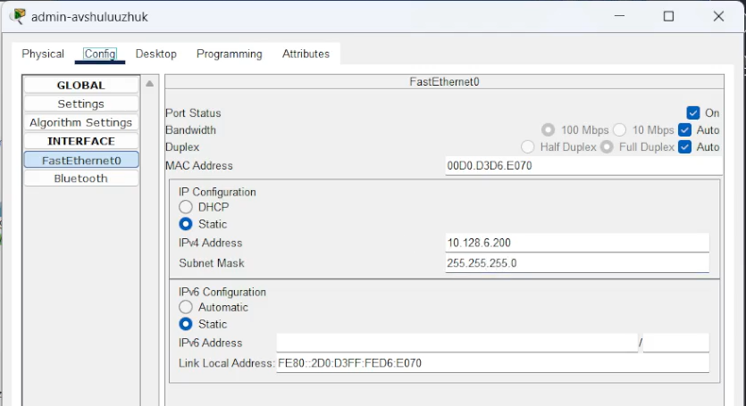{#fig:001 width=70%}

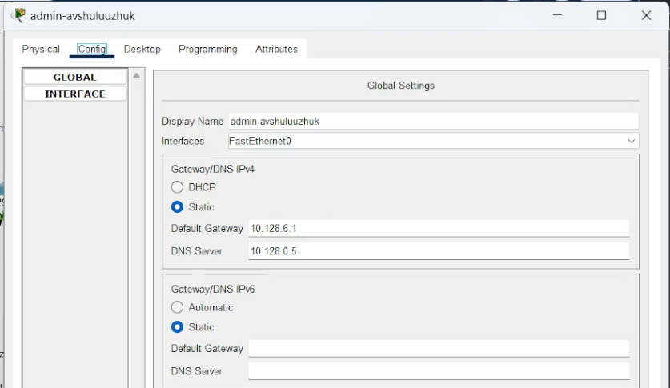{#fig:002 width=70%}

Настроим доступ к web-серверу по порту tcp 80. Здесь: создан список контроля доступа с названием servers-out (так как предполагается ограничить доступ в конкретные подсети и по отношению к маршрутизатору это будет исходящий трафик); указано (в качестве комментария-напоминания remark web), что ограничения предназначены для работы с web-сервером; дано разрешение доступа (permit) по протоколу TCP всем (any) пользователям сети (host) на доступ к web-серверу, имеющему адрес 10.128.0.2, через порт 80.(рис. [-@fig:003])

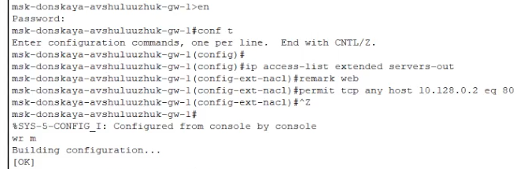{#fig:003 width=70%}

Добавим список управления доступом к интерфейсу. Здесь: к интерфейсу f0/0.3 подключается список прав доступа servers-out и применяется к исходящему трафику (out) (рис. [-@fig:004])

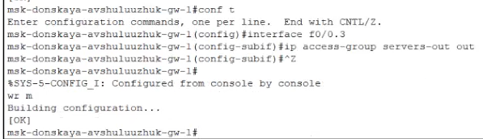{#fig:004 width=70%}

Можно проверить, что доступ к web-серверу есть через протокол HTTP (введя в строке браузера хоста ip-адрес web-сервера). При этом команда ping будет демонстрировать недоступность web-сервера как по имени, так и по ip-адресу web-сервера (рис. [-@fig:005])

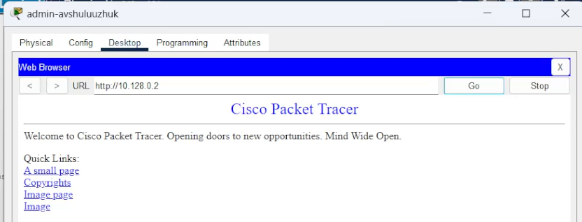{#fig:005 width=70%}

Дополнительный доступ для администратора по протоколам Telnet и FTP. Здесь: в список контроля доступа servers-out добавлено правило, разрешающее устройству администратора с ip-адресом 10.128.6.200 доступ на web-сервер (10.128.0.2) по протоколам FTP и telnet (рис. [-@fig:006])

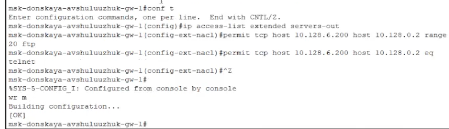{#fig:006 width=70%}

Убедимся, что с узла с ip-адресом 10.128.6.200 есть доступ по протоколу FTP. Для этого в командной строке устройства администратора введем ftp 10.128.0.2, а затем по запросу имя пользователя cisco и пароль cisco (рис. [-@fig:007])

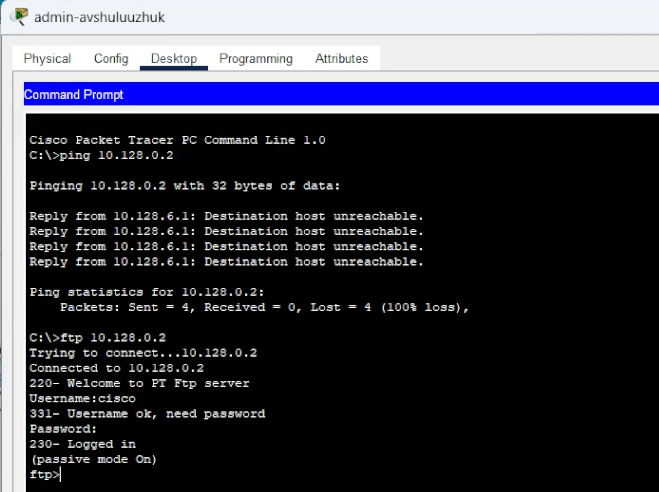{#fig:007 width=70%}

Настройка доступа к файловому серверу. Здесь: в списке контроля доступа servers-out указано (в качестве комментария-напоминания remark file), что следующие ограничения предназначены для работы с file-сервером; всем узлам внутренней сети (10.128.0.0) разрешён доступ по протоколу SMB (работает через порт 445 протокола TCP) к каталогам общего пользования; любым узлам разрешён доступ к file-серверу по протоколу FTP. Запись 0.0.255.255 — обратная маска (wildcard mask) (рис. [-@fig:008])

{#fig:008 width=70%}

Настройка доступа к почтовому серверу. Здесь: в списке контроля доступа servers-out указано (в качестве комментария-напоминания remark mail), что следующие ограничения предназначены для работы с почтовым сервером; всем разрешён доступ к почтовому серверу по протоколам POP3 и SMTP (рис. [-@fig:009])

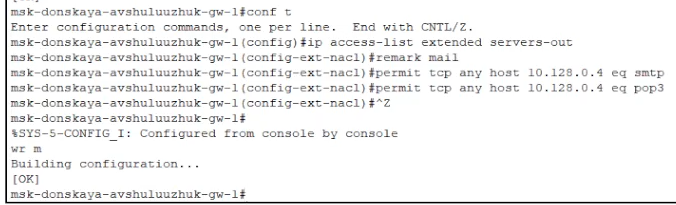{#fig:009 width=70%}

Настройка доступа к DNS-серверу. Здесь: в списке контроля доступа servers-out указано (в качестве комментария-напоминания remark dns), что следующие ограничения предназначены для работы с DNS-сервером; всем узлам внутренней сети разрешён доступ к DNS-серверу через UDP-порт 53 (рис. [-@fig:010])

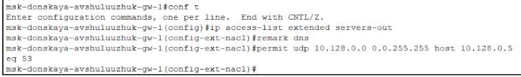{#fig:010 width=70%}

Проверим доступность web-сервера (через браузер) не только по ip-адресу, но и по имени (рис. [-@fig:011])

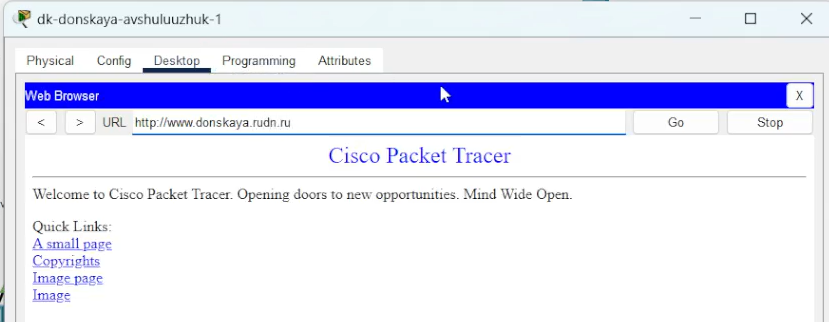{#fig:011 width=70%}

Разрешение icmp-запросов. Здесь демонстрируется явное управление порядком размещения правил — правило разрешения для icmp-запросов добавляется в начало списка контроля доступа (рис. [-@fig:012])

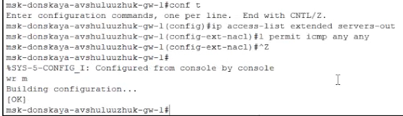{#fig:012 width=70%}

Настройка доступа для сети Other (требуется наложить ограничение на исходящий из сети Other трафик, который по отношению к маршрутизатору msk-donskaya-gw-1 является входящим трафиком). Здесь: в списке контроля доступа other-in указано, что следующие правила относятся к администратору сети; даётся разрешение устройству с адресом 10.128.6.200 на любые действия (any); к интерфейсу f0/0.104 подключается список прав доступа other-in и применяется к входящему трафику (in).(рис. [-@fig:013])

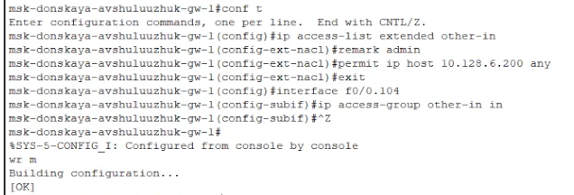{#fig:013 width=70%}

Настройка доступа администратора к сети сетевого оборудования. Здесь: в списке контроля доступа management-out указано (в качестве комментария-напоминания remark admin), что устройству администратора с адресом 10.128.6.200 разрешён доступ к сети сетевого оборудования (10.128.1.0); к интерфейсу f0/0.2 подключается список прав доступа management-out и применяется к исходящему трафику (out) (рис. [-@fig:014])

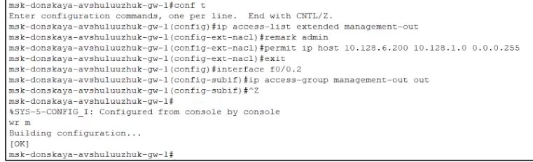{#fig:014 width=70%}

Номера строк правил в списке контроля доступа можно посмотреть с помощью команды show access − lists (рис. [-@fig:015]) 

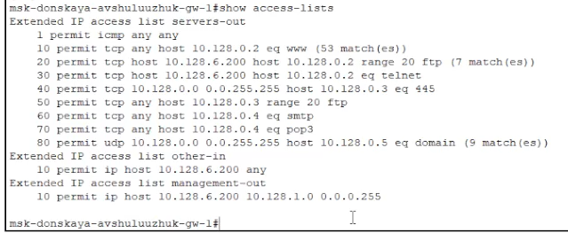{#fig:015 width=70%}

Проверим корректность установленных правил доступа, попытавшись получить доступ по различным протоколам с разных устройств сети к подсети серверов и подсети сетевого оборудования (рис. [-@fig:016]) (рис. [-@fig:017])

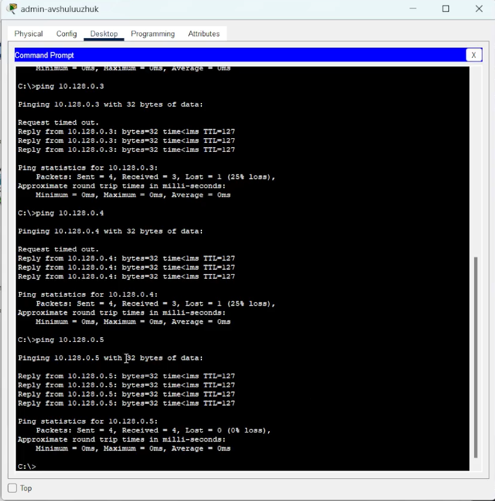{#fig:016 width=70%}

{#fig:017 width=70%}

Разрешим администратору из сети Other на Павловской действия, аналогичные действиям администратора сети Other на Донской (рис. [-@fig:018])

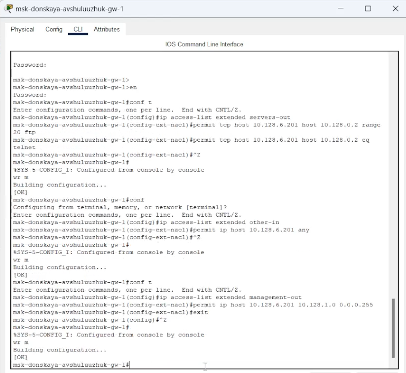{#fig:018 width=70%}

# Выводы

В результате выполнения лабораторной работы было освоено настройка прав доступа пользователей к ресурсам сети.

# Контрольные вопросы

1. Как задать действие правила для конкретного протокола?
Чтобы задать действие правила для конкретного протокола, необходимо указать его в настройках правила. Например, если вы используете iptables (в Linux), вы можете сделать это следующим образом
Здесь -p tcp указывает, что правило применяется только к TCP-протоколу.

2. Как задать действие правила сразу для нескольких портов?
Для задания действия правила для нескольких портов можно использовать перечисление или диапазон портов. Например, в iptables вы можете использовать -m multiport:

iptables -A INPUT -p tcp -m multiport --dports 80,443 -j ACCEPT

Либо задать диапазон:

iptables -A INPUT -p tcp --dport 1000:2000 -j ACCEPT

3. Как узнать номер правила в списке прав доступа?
Чтобы узнать номер правила в списке прав доступа, можно использовать команду, которая отображает все правила с номерами, например, в iptables:   

iptables -L --line-numbers

Это выведет список правил с номерами строк.

4. Каким образом можно изменить порядок применения правил в списке контроля доступа?
Порядок применения правил обычно определяется их расположением в списке. В iptables для изменения порядка необходимо удалить правило и затем добавить его снова, либо использовать команды, которые позволяют задать правила в определенных позициях. Например    

iptables -D INPUT 2  # Удалить правило номер 2
iptables -I INPUT 1  # Вставить правило на первую позицию
