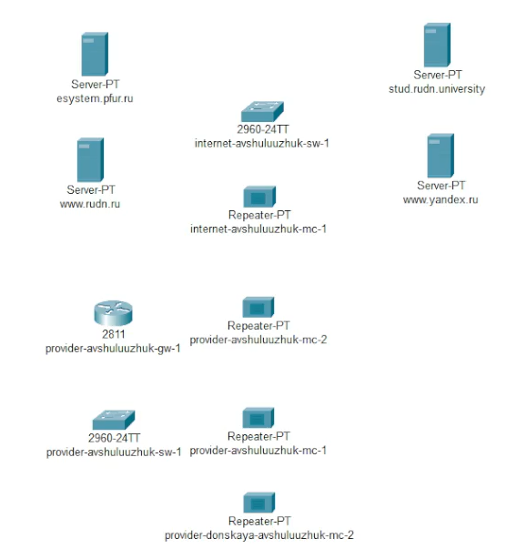
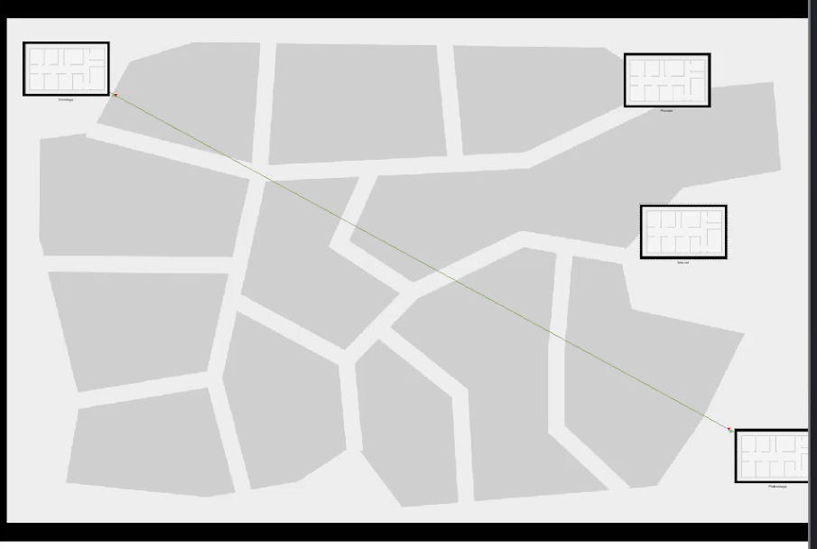
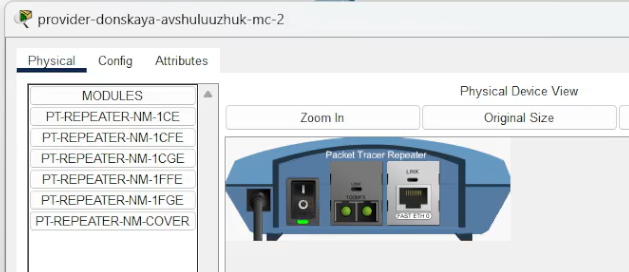
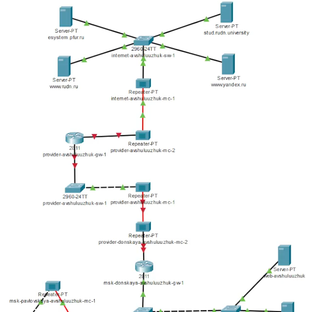
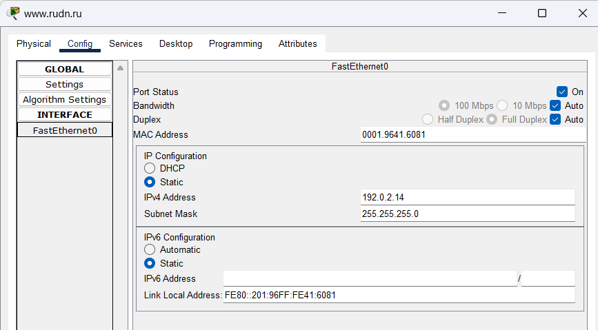
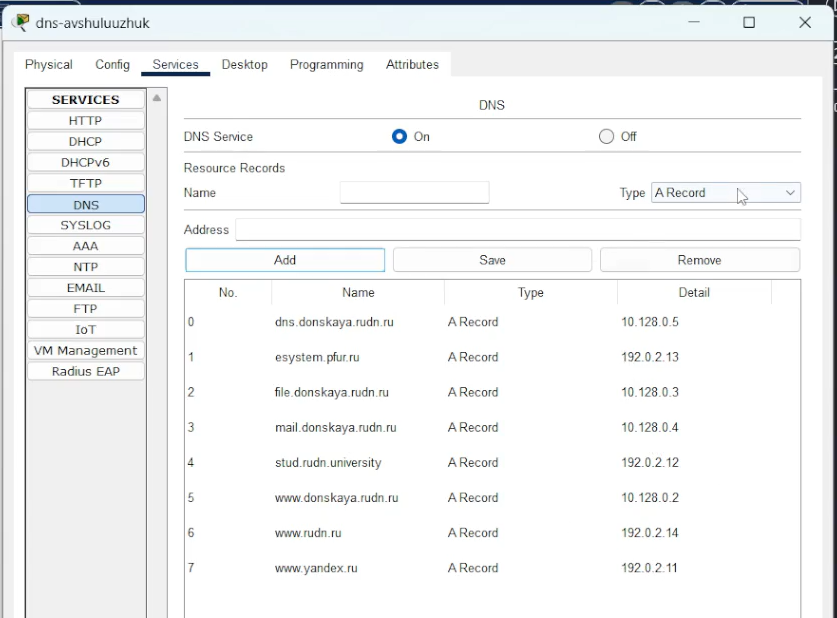
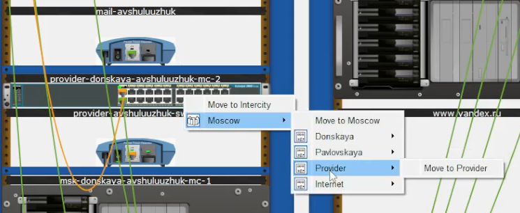
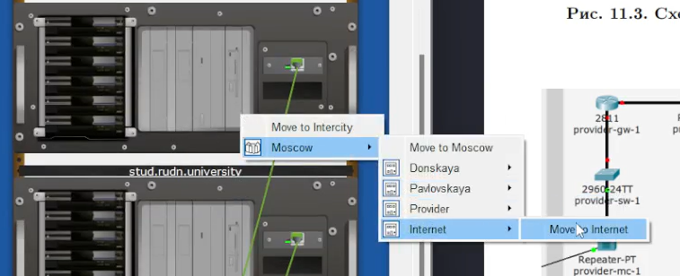

---
## Front matter
title: "Настройка NAT. Планирование"
subtitle: "Лабораторная работа  № 11"
author: "Шулуужук Айраана НПИбд-02-22"

## Generic otions
lang: ru-RU
toc-title: "Содержание"

## Bibliography
bibliography: bib/cite.bib
csl: pandoc/csl/gost-r-7-0-5-2008-numeric.csl

## Pdf output format
toc: true # Table of contents
toc-depth: 2
lof: true # List of figures
lot: true # List of tables
fontsize: 12pt
linestretch: 1.5
papersize: a4
documentclass: scrreprt
## I18n polyglossia
polyglossia-lang:
  name: russian
  options:
	- spelling=modern
	- babelshorthands=true
polyglossia-otherlangs:
  name: english
## I18n babel
babel-lang: russian
babel-otherlangs: english
## Fonts
mainfont: IBM Plex Serif
romanfont: IBM Plex Serif
sansfont: IBM Plex Sans
monofont: IBM Plex Mono
mathfont: STIX Two Math
mainfontoptions: Ligatures=Common,Ligatures=TeX,Scale=0.94
romanfontoptions: Ligatures=Common,Ligatures=TeX,Scale=0.94
sansfontoptions: Ligatures=Common,Ligatures=TeX,Scale=MatchLowercase,Scale=0.94
monofontoptions: Scale=MatchLowercase,Scale=0.94,FakeStretch=0.9
mathfontoptions:
## Biblatex
biblatex: true
biblio-style: "gost-numeric"
biblatexoptions:
  - parentracker=true
  - backend=biber
  - hyperref=auto
  - language=auto
  - autolang=other*
  - citestyle=gost-numeric
## Pandoc-crossref LaTeX customization
figureTitle: "Рис."
tableTitle: "Таблица"
listingTitle: "Листинг"
lofTitle: "Список иллюстраций"
lotTitle: "Список таблиц"
lolTitle: "Листинги"
## Misc options
indent: true
header-includes:
  - \usepackage{indentfirst}
  - \usepackage{float} # keep figures where there are in the text
  - \floatplacement{figure}{H} # keep figures where there are in the text
---

# Цель работы

Провести подготовительные мероприятия по подключению локальной сети организации к Интернету.

# Задание

1. Построить схему подсоединения локальной сети к Интернету.
2. Построить модельные сети провайдера и сети Интернет
3. Построить схемы сетей L1, L2, L3.
4. При выполнении работы необходимо учитывать соглашение об именовании
 
# Выполнение лабораторной работы

На схеме предыдущего вашего проекта разместите согласно рис. 11.2 необходимое оборудование для сети провайдера и сети модельного Интернета: 4 медиаконвертера (Repeater-PT), 2 коммутатора типа Cisco 2960-24TT, маршрутизатор типа Cisco 2811, 4 сервера. Присвоим названия размещённым в сети провайдера и в сети модельного Интернета объектам согласно модельным предположениям и схеме L1 (рис. [-@fig:001])

{#fig:001 width=70%}

В физической рабочей области добавьте здание провайдера и здание, имитирующее расположение серверов модельного Интернета. Присвоим им соответствующие названия: Provider and Internet (рис. [-@fig:002])

{#fig:002 width=70%}

На медиаконвертерах замените имеющиеся модули на PT-REPEATER-NM-1FFE и PT-REPEATER-NM-1CFE для подключения витой пары по технологии Fast Ethernet и оптоволокна соответственно (рис. [-@fig:003])

{#fig:003 width=70%}

Проведем соединение объектов согласно скорректированной схеме L1. (рис. [-@fig:004])

{#fig:004 width=70%}

Пропишем IP-адреса серверам (рис. [-@fig:005])

{#fig:005 width=70%}

Пропишем сведения о серверах на DNS-сервере сети «Донская (рис. [-@fig:006])

{#fig:006 width=70%}

Перенесем из сети «Донская» оборудование провайдера и модельной сети Интернета в соответствующие здания (рис. [-@fig:007]) (рис. [-@fig:008])

{#fig:007 width=70%}

{#fig:008 width=70%}

# Выводы

В результате выполнения лабораторной работы было проведены подготовительные мероприятия по подключению локальной сети организации к Интернету.

# Контрольные вопросы

1. Network Address Translation (NAT) — это метод преобразования IP-адресов в сетях, который позволяет множеству устройств в локальной сети (LAN) использовать один общий внешний IP-адрес для выхода в интернет. NAT изменяет заголовки пакетов, заменяя исходные адреса на внешний адрес маршрутизатора и наоборот, когда данные возвращаются в локальную сеть. Это помогает скрыть внутреннюю структуру сети и позволяет выполнять адресную экономию.

2. Как определить, находится ли узел сети за NAT: 
   - Попробуйте использовать внешние сервисы для определения IP-адреса, такие как "whatismyip.com". Если адрес, полученный от такого сервиса, отличается от адреса, который вы использовали для доступа в интернет, значит, устройство находится за NAT.
   - Можно также провести тестирование, например, с помощью утилит, которые пытаются получить информацию о сетевом соединении. Любой адрес, который не соответствует определённому диапазону внутренних адресов (например, 192.168.x.x, 10.x.x.x или 172.16.x.x - 172.31.x.x), может указывать на NAT.

3. Оборудование, отвечающее за преобразование адреса методом NAT: В основном это маршрутизаторы и брандмауэры. Они могут выполнять NAT для всех подключенных пользователей в локальной сети. Маршрутизаторы, как правило, имеют встроенные механизмы NAT, позволяющие автоматически обрабатывать преобразование IP-адресов при передаче данных.

4. Отличие статического, динамического и перегруженного NAT:
   - Статический NAT: Каждому внутреннему IP-адресу соответствует один определенный внешний IP-адрес. Используется для постоянного связывания, когда необходимо, чтобы внешний ресурс всегда мог находить устройство по одному и тому же адресу.
   - Динамический NAT: Внутренние IP-адреса переводятся в пул внешних IP-адресов. Когда устройство обращается к интернету, ему назначается временный внешний IP-адрес из заранее определенного пула, который может меняться при каждом новом соединении.
   - Перегруженный NAT (или PAT, Port Address Translation): Несколько внутренних IP-адресов могут использовать один и тот же внешний IP-адрес, различаясь между собой по номерам портов. Этот метод помогает сократить количество необходимых внешних IP-адресов.

5. Типы NAT:
   - Статический NAT: Первичный тип NAT, при котором один внутренний адрес всегда отображается на один внешний.
   - Динамический NAT: Как упоминалось ранее, внутренние адреса преобразуются в пул внешних адресов.
   - Перегруженный NAT (PAT): Несколько внутренних устройств используют один внешний адрес, различаясь по портам.
   - NAT с маршрутизацией: В этом случае NAT применяется к маршрутизируемым адресам, что позволяет поддерживать связь между сетью и интернетом более эффективно.
   - NAT на уровне приложения: Используется в некоторых приложениях, например, в VoIP, где NAT обрабатывает tрафик с учетом специфики приложения, чтобы обеспечить совместимость.
