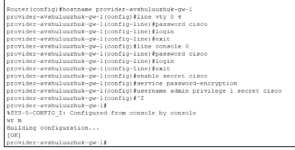
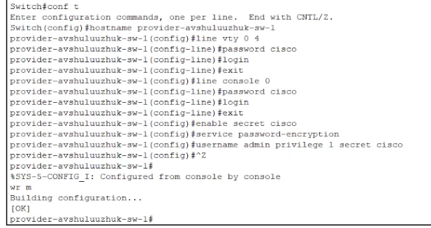
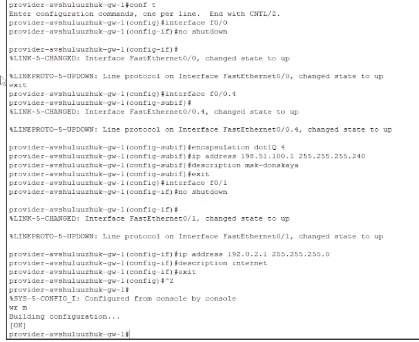
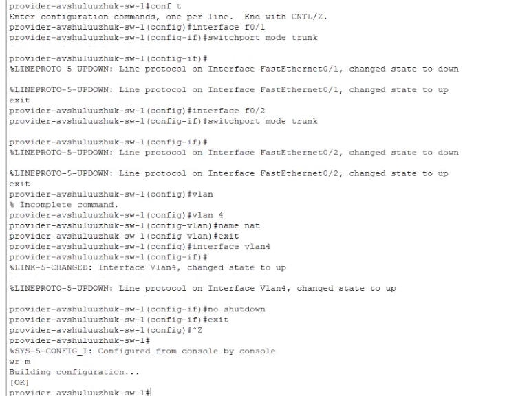
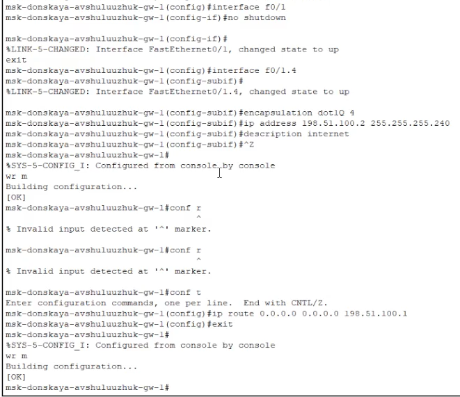
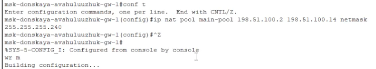
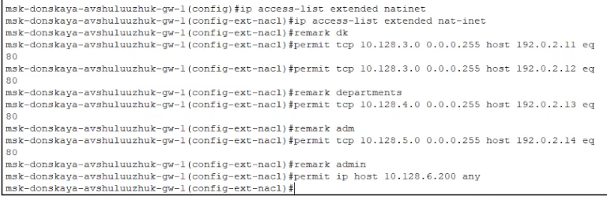
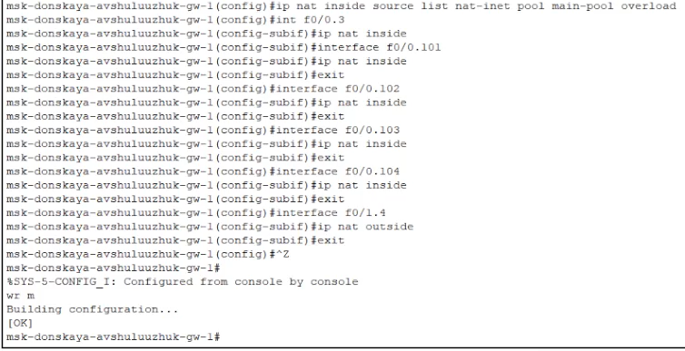
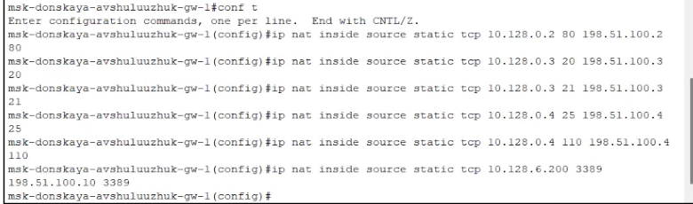

---
## Front matter
title: "Настройка NAT"
subtitle: "Лабораторная работа  № 12"
author: "Шулуужук Айраана НПИбд-02-22"

## Generic otions
lang: ru-RU
toc-title: "Содержание"

## Bibliography
bibliography: bib/cite.bib
csl: pandoc/csl/gost-r-7-0-5-2008-numeric.csl

## Pdf output format
toc: true # Table of contents
toc-depth: 2
lof: true # List of figures
lot: true # List of tables
fontsize: 12pt
linestretch: 1.5
papersize: a4
documentclass: scrreprt
## I18n polyglossia
polyglossia-lang:
  name: russian
  options:
	- spelling=modern
	- babelshorthands=true
polyglossia-otherlangs:
  name: english
## I18n babel
babel-lang: russian
babel-otherlangs: english
## Fonts
mainfont: IBM Plex Serif
romanfont: IBM Plex Serif
sansfont: IBM Plex Sans
monofont: IBM Plex Mono
mathfont: STIX Two Math
mainfontoptions: Ligatures=Common,Ligatures=TeX,Scale=0.94
romanfontoptions: Ligatures=Common,Ligatures=TeX,Scale=0.94
sansfontoptions: Ligatures=Common,Ligatures=TeX,Scale=MatchLowercase,Scale=0.94
monofontoptions: Scale=MatchLowercase,Scale=0.94,FakeStretch=0.9
mathfontoptions:
## Biblatex
biblatex: true
biblio-style: "gost-numeric"
biblatexoptions:
  - parentracker=true
  - backend=biber
  - hyperref=auto
  - language=auto
  - autolang=other*
  - citestyle=gost-numeric
## Pandoc-crossref LaTeX customization
figureTitle: "Рис."
tableTitle: "Таблица"
listingTitle: "Листинг"
lofTitle: "Список иллюстраций"
lotTitle: "Список таблиц"
lolTitle: "Листинги"
## Misc options
indent: true
header-includes:
  - \usepackage{indentfirst}
  - \usepackage{float} # keep figures where there are in the text
  - \floatplacement{figure}{H} # keep figures where there are in the text
---

# Цель работы

Приобретение практических навыков по настройке доступа локальной сети к внешней сети посредством NAT.
 
# Выполнение лабораторной работы

Сделаем первоначальную настройку маршрутизатора provider-gw-1 и коммутатора provider-sw-1 провайдера: задать имя, настроить доступ по паролю (рис. [-@fig:001]) (рис. [-@fig:002])

{#fig:001 width=70%}

{#fig:002 width=70%}

Настроим интерфейсы маршрутизатора provider-gw-1 и коммутатора provider-sw-1 провайдера (рис. [-@fig:003]) (рис. [-@fig:004])

{#fig:003 width=70%}

{#fig:004 width=70%}

Настроим интерфейсы маршрутизатора сети «Донская» для доступа к сети провайдера (рис. [-@fig:005])

{#fig:005 width=70%}

Настроим на маршрутизаторе сети «Донская» NAT с правилами, указанными в разделе 12.2 (рис. [-@fig:006]) (рис. [-@fig:007]) (рис. [-@fig:008])

{#fig:006 width=70%}

{#fig:007 width=70%}

{#fig:008 width=70%}

Настроим доступ из внешней сети в локальную сеть организации, как указано в разделе 12.2 (рис. [-@fig:009])

{#fig:009 width=70%}

# Выводы

В результате выполнения лабораторной работы были приобретены практические навыки по настройке доступа локальной сети к внешней сети посредством NAT.

# Контрольные вопросы

1. В чём состоит основной принцип работы NAT (что даёт наличие NAT в сети
организации)?

Основной принцип работы NAT:
NAT (Network Address Translation) — это технология, позволяющая изменять IP-адреса в пакетах, проходящих через маршрутизатор или межсетевой экран. Основное предназначение NAT — это скрытие внутренних IP-адресов частной сети от внешней сети (например, интернета) и возможность подключения множества устройств, использующих частные адреса, к интернету с помощью одного (или нескольких) публичных IP-адресов. Преимущества использования NAT в сети организации включают экономию адресного пространства (возможность использования частных адресов), увеличенную безопасность (скрытие внутренней сети), а также упрощение управления сетевыми адресами.

2. В чём состоит принцип настройки NAT (на каком оборудовании и что
нужно настроить для из локальной сети во внешнюю сеть через NAT)?

Принцип настройки NAT:
NAT настраивается на маршрутизаторе или межсетевом экране, который соединяет локальную сеть с внешней. Основные шаги для настройки NAT включают:

    Определение интерфейсов: необходимо указать, какие интерфейсы будут внутренними (частные) и внешними (публичные).
    Настройка NAT правил: настраиваются правила, определяющие, какие внутренние адреса будут преобразовываться в какие внешние. Это может быть динамическое или статическое преобразование.
    Проверка и тестирование конфигурации, чтобы убедиться, что пакеты корректно маршрутизируются и адреса преобразуются.

3. Можно ли применить Cisco IOS NAT к субинтерфейсам?

Применение Cisco IOS NAT к субинтерфейсам:
Да, Cisco IOS поддерживает применение NAT к субинтерфейсам. Это позволяет использовать разные NAT-параметры для различных виртуальных интерфейсов на одном физическом интерфейсе маршрутизатора. С помощью субинтерфейсов можно легко управлять разными сетями и их NAT-настройками.

4. Что такое пулы IP NAT?

Пулы IP NAT:
Пулы IP NAT — это группы публичных IP-адресов, которые могут быть динамически назначены внутренним устройствам при выходе в интернет. Когда несколько устройств пытаются использовать один и тот же публичный IP-адрес, NAT может использовать эту группу адресов для обеспечения доступа к интернету многим устройствам, путем назначения внутренним адресам внешних адресов из пула по мере необходимости

5. Что такое статические преобразования NAT?

Статические преобразования NAT:
Статические преобразования NAT относятся к фиксированному сопоставлению одного внутреннего IP-адреса с определенным внешним IP-адресом. Статическое NAT используется, когда необходимо обеспечить постоянный доступ к определенному внутреннему ресурсу (например, серверу) из внешней сети. Таким образом, запросы к публичному IP-адресу будут всегда направляться на заданный внутренний адрес.
