---
## Front matter
title: "Статическая маршрутизация в Интернете. Планирование"
subtitle: "Лабораторная работа  № 13"
author: "Шулуужук Айраана НПИбд-02-22"

## Generic otions
lang: ru-RU
toc-title: "Содержание"

## Bibliography
bibliography: bib/cite.bib
csl: pandoc/csl/gost-r-7-0-5-2008-numeric.csl

## Pdf output format
toc: true # Table of contents
toc-depth: 2
lof: true # List of figures
lot: true # List of tables
fontsize: 12pt
linestretch: 1.5
papersize: a4
documentclass: scrreprt
## I18n polyglossia
polyglossia-lang:
  name: russian
  options:
	- spelling=modern
	- babelshorthands=true
polyglossia-otherlangs:
  name: english
## I18n babel
babel-lang: russian
babel-otherlangs: english
## Fonts
mainfont: IBM Plex Serif
romanfont: IBM Plex Serif
sansfont: IBM Plex Sans
monofont: IBM Plex Mono
mathfont: STIX Two Math
mainfontoptions: Ligatures=Common,Ligatures=TeX,Scale=0.94
romanfontoptions: Ligatures=Common,Ligatures=TeX,Scale=0.94
sansfontoptions: Ligatures=Common,Ligatures=TeX,Scale=MatchLowercase,Scale=0.94
monofontoptions: Scale=MatchLowercase,Scale=0.94,FakeStretch=0.9
mathfontoptions:
## Biblatex
biblatex: true
biblio-style: "gost-numeric"
biblatexoptions:
  - parentracker=true
  - backend=biber
  - hyperref=auto
  - language=auto
  - autolang=other*
  - citestyle=gost-numeric
## Pandoc-crossref LaTeX customization
figureTitle: "Рис."
tableTitle: "Таблица"
listingTitle: "Листинг"
lofTitle: "Список иллюстраций"
lotTitle: "Список таблиц"
lolTitle: "Листинги"
## Misc options
indent: true
header-includes:
  - \usepackage{indentfirst}
  - \usepackage{float} # keep figures where there are in the text
  - \floatplacement{figure}{H} # keep figures where there are in the text
---

# Цель работы

Провести подготовительные мероприятия по организации взаимодействия через сеть провайдера посредством статической маршрутизации локальной сети с сетью основного здания, расположенного в 42-м квартале в Москве, и сетью филиала, расположенного в г. Сочи.
 
# Выполнение лабораторной работы

Внесем изменения в схемы L1, L2 и L3 сети, добавив в них информацию о сети основной территории (42-й квартал в Москве) и сети филиала в г. Сочи (рис. [-@fig:001]) (рис. [-@fig:002]) (рис. [-@fig:003]) (рис. [-@fig:004])

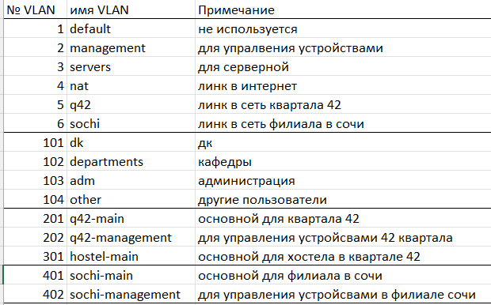{#fig:001 width=70%}

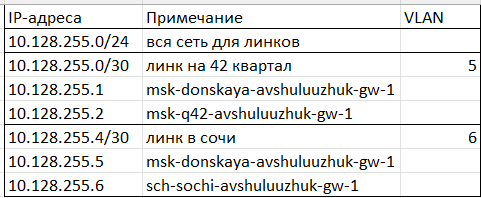{#fig:002 width=70%}

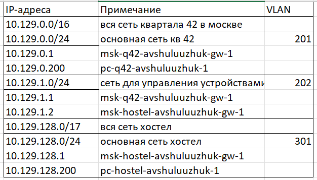{#fig:003 width=70%}

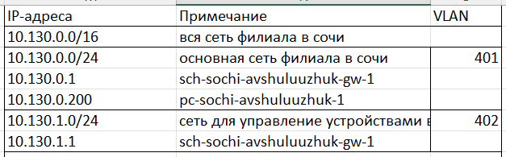{#fig:004 width=70%}

На схеме предыдущего вашего проекта разместите согласно рис. 13.2 необходимое оборудование: 4 медиаконвертера (Repeater-PT), 2 маршрутизатора типа Cisco 2811, 1 маршрутизирующий коммутатор типа Cisco 3560-24PS, 2 коммутатора типа Cisco 2950-24, коммутатор Cisco 2950-24T, 3 оконечных устройства типа PC-PT. Присвойте названия размещённым согласно рис. 13.2 объектам. (рис. [-@fig:005])

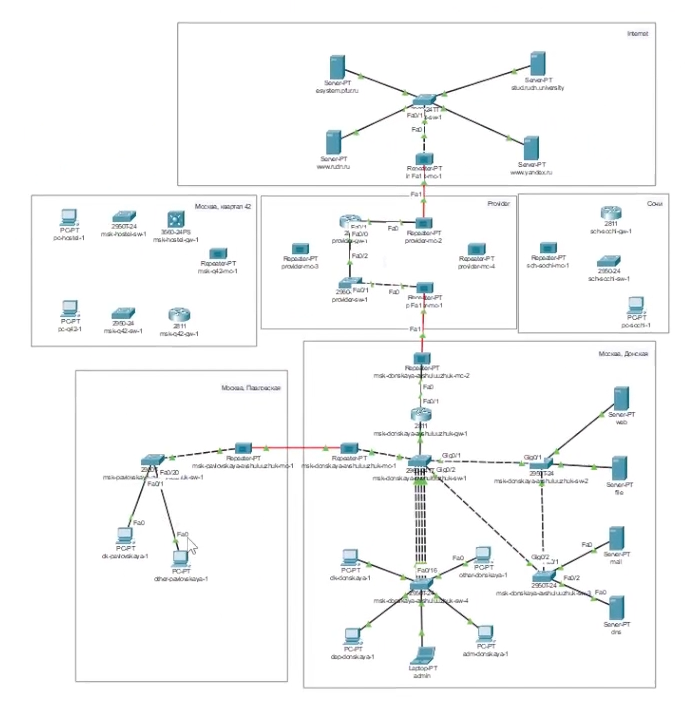{#fig:005 width=70%}

На медиаконвертерах заменим имеющиеся модули на PT-REPEATER-NM-1FFE и PT-REPEATER-NM-1CFE для подключения витой пары по технологии Fast Ethernet и оптоволокна соответственно (рис. [-@fig:006])

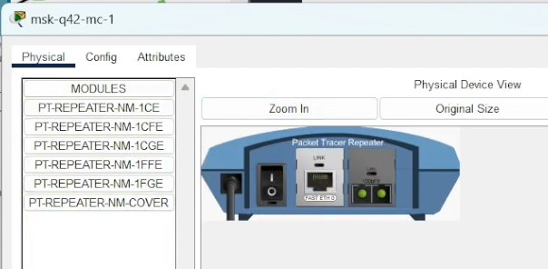{#fig:006 width=70%}

На маршрутизаторе msk-q42-gw-1 добавьте дополнительный интерфейс NM-2FE2W (рис. [-@fig:007]) (рис. [-@fig:008])

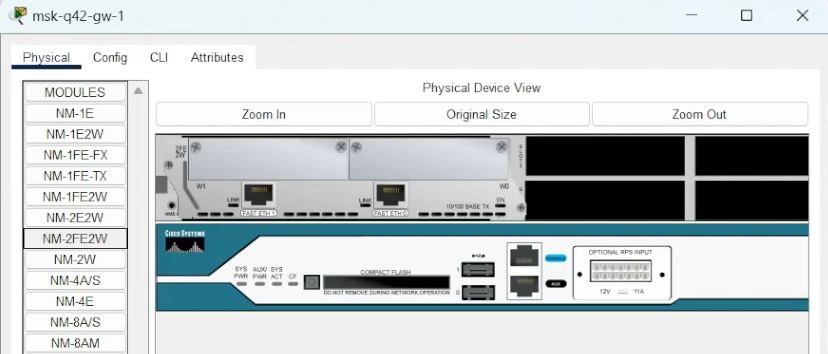{#fig:007 width=70%}

В физической рабочей области Packet Tracer добавьте в г. Москва здание 42-го квартала, присвоем ему соответствующее название (рис. [-@fig:008])

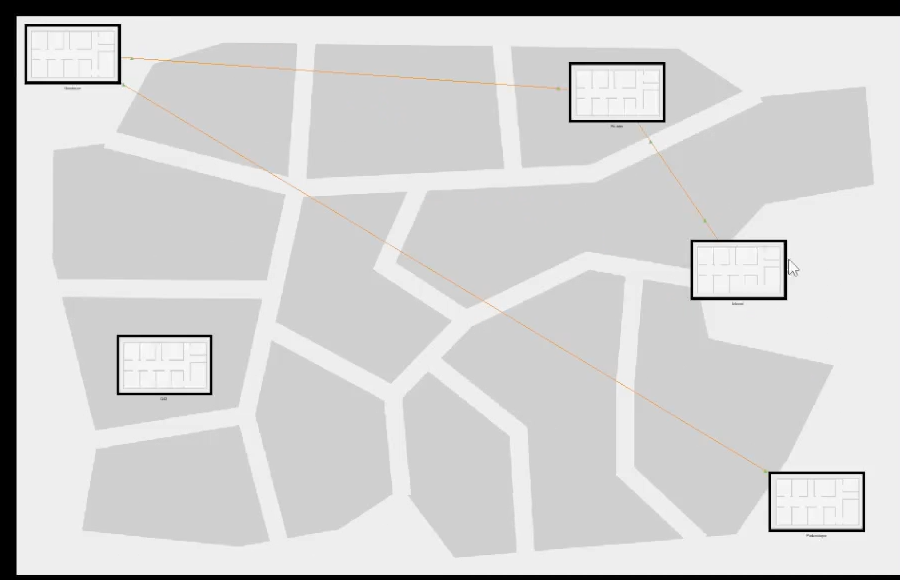{#fig:008 width=70%}

В физической рабочей области Packet Tracer добавим город Сочи и в нём здание филиала, присвоем ему соответствующее название (рис. [-@fig:009])

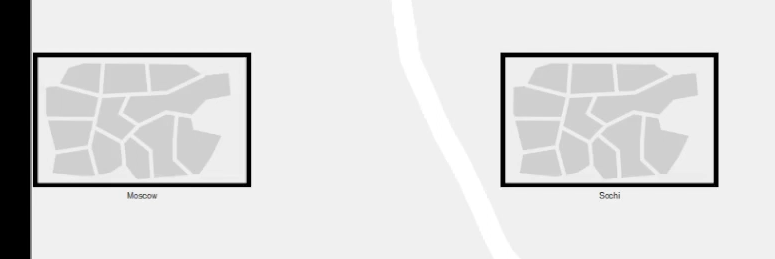{#fig:009 width=70%}

Перенесем из сети «Донская» оборудование сети 42-го квартала и сети филиала в соответствующие здания (рис. [-@fig:010])

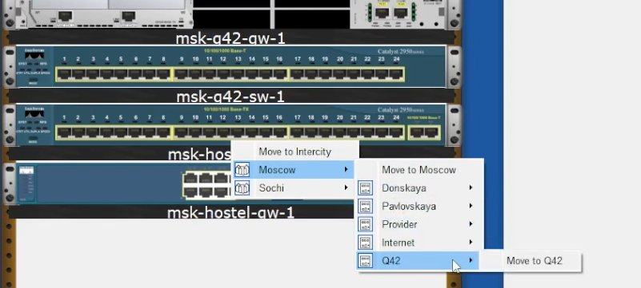{#fig:010 width=70%}

Проведем соединение объектов согласно скорректированной схеме L1 (рис. [-@fig:011])

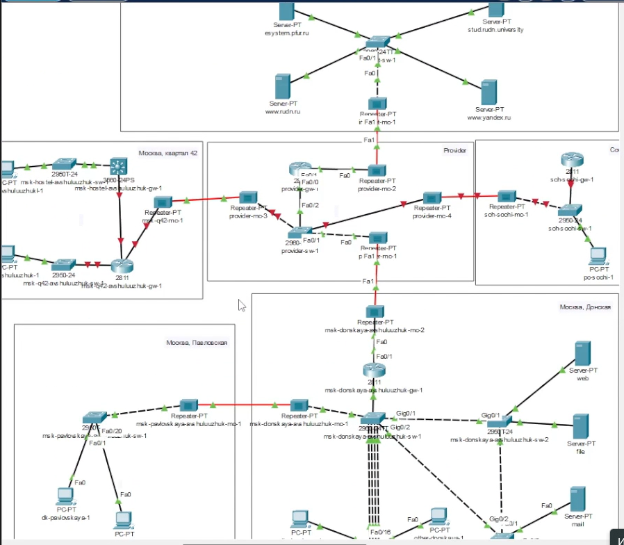{#fig:011 width=70%}

Проведем первоначальную настройку необходимого оборудования (рис. [-@fig:012]) (рис. [-@fig:013])

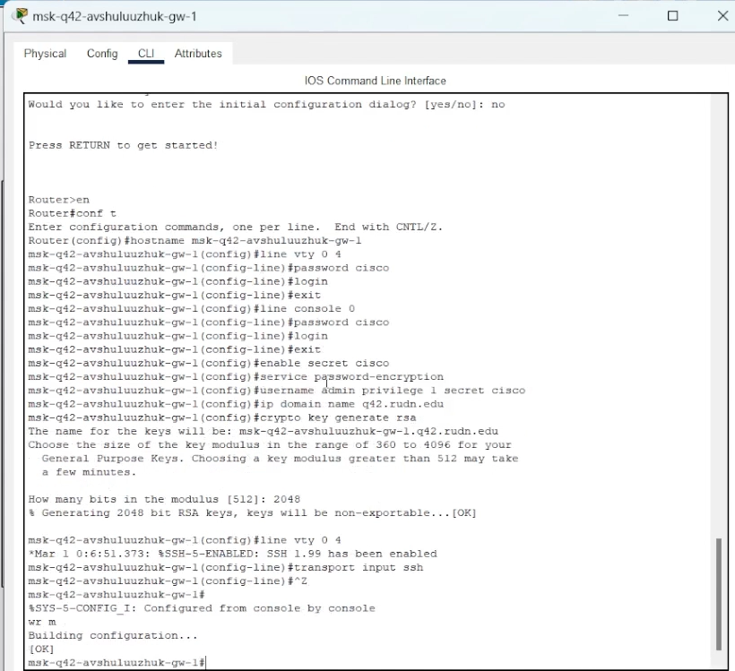{#fig:012 width=70%}

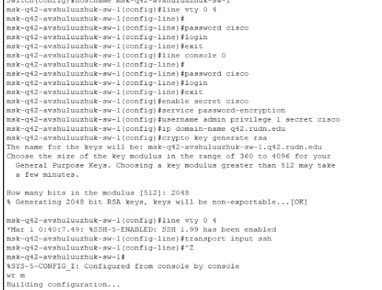{#fig:013 width=70%}

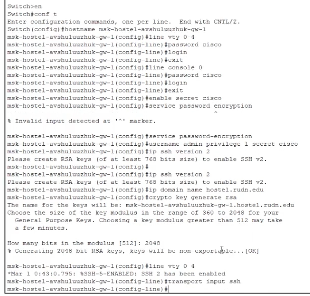{#fig:014 width=70%}

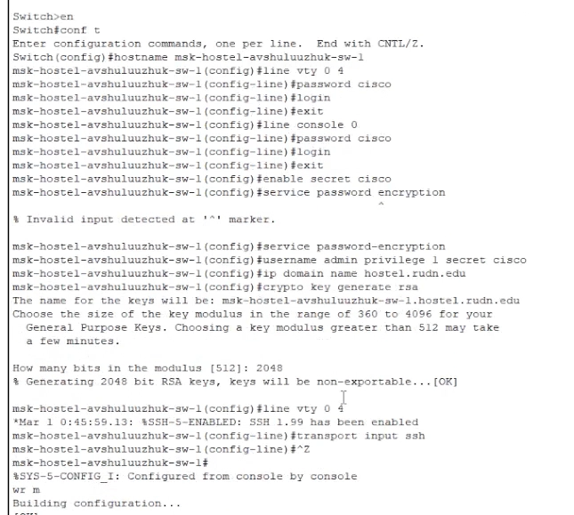{#fig:015 width=70%}

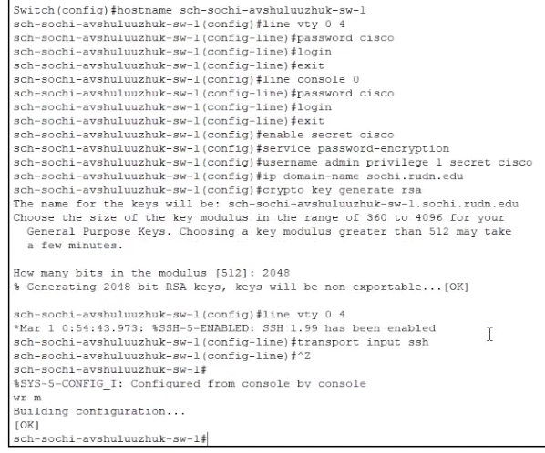{#fig:016 width=70%}

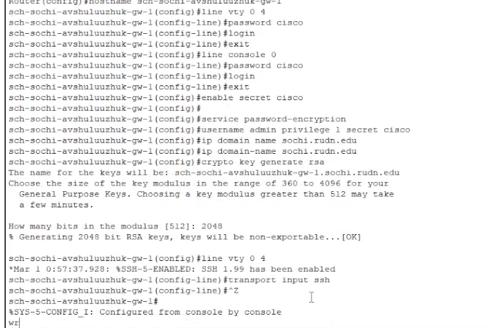{#fig:017 width=70%}

# Выводы

В результате выполнения лабораторной работы были проведены подготовительные мероприятия по организации взаимодействия через сеть провайдера посредством статической маршрутизации локальной сети с сетью основного здания, расположенного в 42-м квартале в Москве, и сетью филиала, расположенного в г. Сочи.

# Контрольные вопросы

1. В каких случаях следует использовать статическую маршрутизацию? При-
ведите примеры.

Статическая маршрутизация - это метод, при котором сетевой администратор вручную настраивает маршруты в таблице маршрутизации устройства (например, маршрутизатора). Это отличается от динамической маршрутизации, где маршрутизаторы обмениваются информацией и автоматически обновляют свои таблицы маршрутизации.

Статическую маршрутизацию следует использовать в следующих случаях:

    Небольшие, простые сети: В сетях с небольшим количеством маршрутизаторов и предсказуемой топологией статическая маршрутизация может быть проще в настройке и управлении. Нет необходимости в сложных протоколах маршрутизации.
        Пример: Домашняя сеть с одним маршрутизатором, который подключается к интернету. Вы просто указываете маршрут по умолчанию через шлюз провайдера.

2. Укажите основные принципы статической маршрутизации между VLANs.

Маршрутизация между VLANs (Virtual Local Area Networks) необходима, потому что VLANs по своей природе разделяют широковещательные домены. Устройства в разных VLANs не могут общаться напрямую на втором уровне модели OSI (канальный уровень). Для связи между VLANs требуется устройство третьего уровня (сетевой уровень), обычно маршрутизатор или коммутатор третьего уровня.

