---
## Front matter
title: "Динамическая маршрутизация"
subtitle: "Лабораторная работа  № 15"
author: "Шулуужук Айраана НПИбд-02-22"

## Generic otions
lang: ru-RU
toc-title: "Содержание"

## Bibliography
bibliography: bib/cite.bib
csl: pandoc/csl/gost-r-7-0-5-2008-numeric.csl

## Pdf output format
toc: true # Table of contents
toc-depth: 2
lof: true # List of figures
lot: true # List of tables
fontsize: 12pt
linestretch: 1.5
papersize: a4
documentclass: scrreprt
## I18n polyglossia
polyglossia-lang:
  name: russian
  options:
	- spelling=modern
	- babelshorthands=true
polyglossia-otherlangs:
  name: english
## I18n babel
babel-lang: russian
babel-otherlangs: english
## Fonts
mainfont: IBM Plex Serif
romanfont: IBM Plex Serif
sansfont: IBM Plex Sans
monofont: IBM Plex Mono
mathfont: STIX Two Math
mainfontoptions: Ligatures=Common,Ligatures=TeX,Scale=0.94
romanfontoptions: Ligatures=Common,Ligatures=TeX,Scale=0.94
sansfontoptions: Ligatures=Common,Ligatures=TeX,Scale=MatchLowercase,Scale=0.94
monofontoptions: Scale=MatchLowercase,Scale=0.94,FakeStretch=0.9
mathfontoptions:
## Biblatex
biblatex: true
biblio-style: "gost-numeric"
biblatexoptions:
  - parentracker=true
  - backend=biber
  - hyperref=auto
  - language=auto
  - autolang=other*
  - citestyle=gost-numeric
## Pandoc-crossref LaTeX customization
figureTitle: "Рис."
tableTitle: "Таблица"
listingTitle: "Листинг"
lofTitle: "Список иллюстраций"
lotTitle: "Список таблиц"
lolTitle: "Листинги"
## Misc options
indent: true
header-includes:
  - \usepackage{indentfirst}
  - \usepackage{float} # keep figures where there are in the text
  - \floatplacement{figure}{H} # keep figures where there are in the text
---

# Цель работы

Настроить динамическую маршрутизацию между территориями организации.
 
# Выполнение лабораторной работы

Настроить динамическую маршрутизацию по протоколу OSPF на маршрутизаторах msk-donskaya-gw-1, msk-q42-gw-1, msk-hostel-gw-1, sch-sochi-gw-1(рис. [-@fig:001]) (рис. [-@fig:002]) (рис. [-@fig:003]) (рис. [-@fig:004])

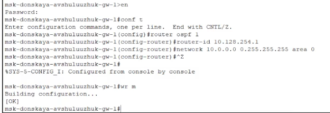{#fig:001 width=70%}

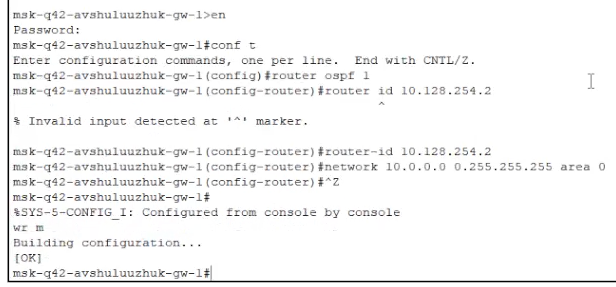{#fig:002 width=70%}

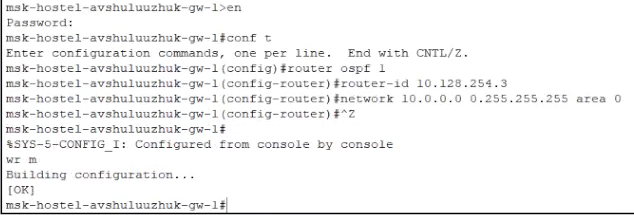{#fig:003 width=70%}

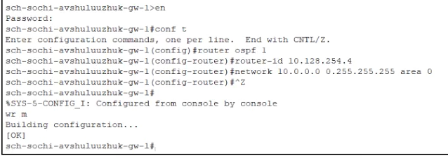{#fig:004 width=70%}

Проверим состояние протокола OSPF на всех маршрутизаторах (рис. [-@fig:005]) (рис. [-@fig:006]) (рис. [-@fig:007]) (рис. [-@fig:008])

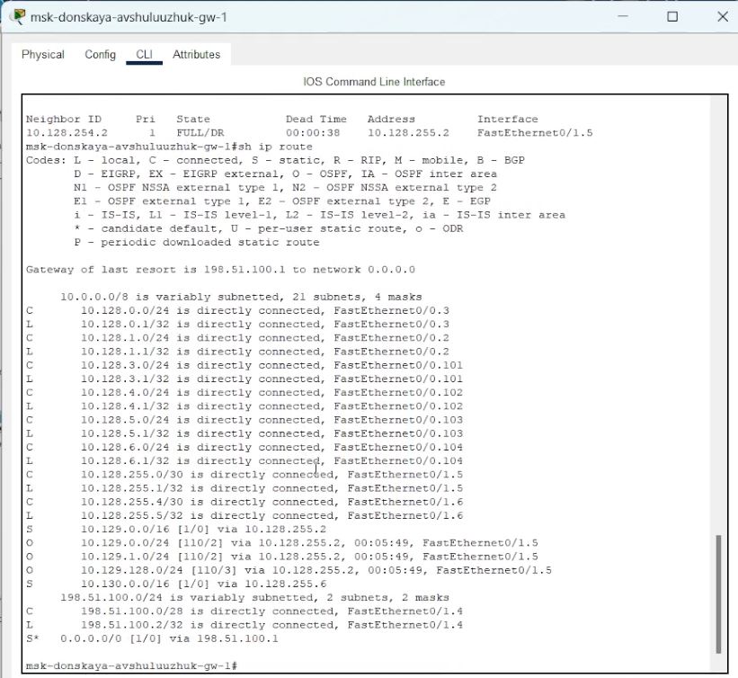{#fig:005 width=70%}

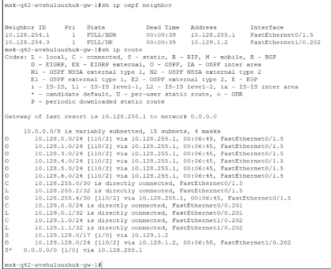{#fig:006 width=70%}

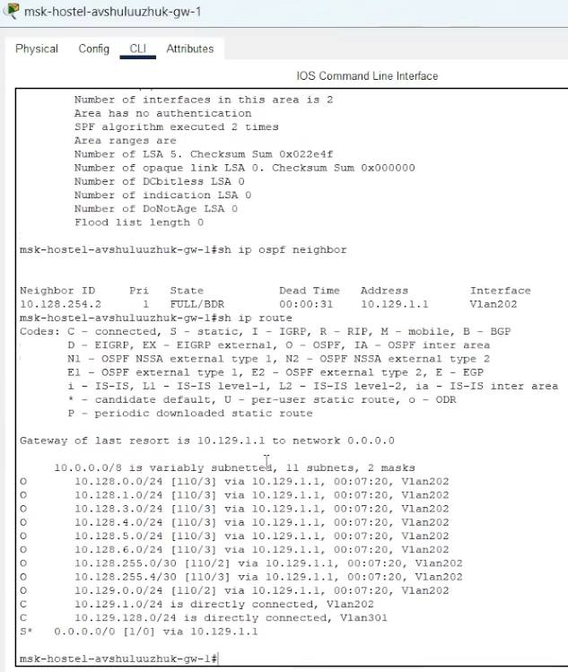{#fig:007 width=70%}

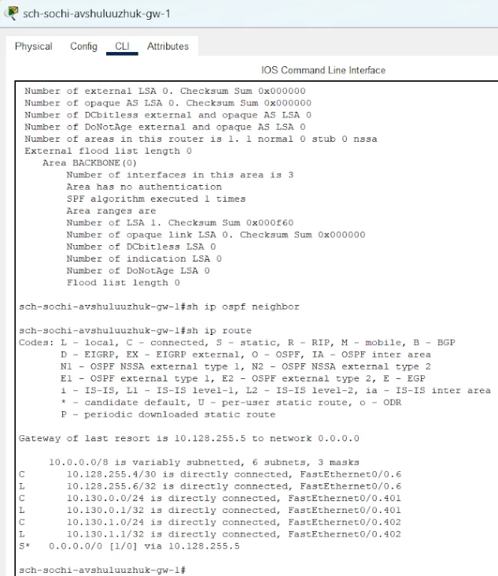{#fig:008 width=70%}

Настроим связь сети квартала 42 в Москве с сетью филиала в г. Сочи напрямую (рис. [-@fig:009]) (рис. [-@fig:010]) (рис. [-@fig:011]) (рис. [-@fig:012]) 

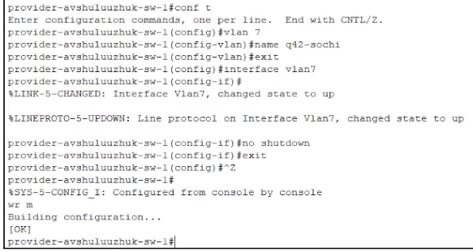{#fig:009 width=70%}

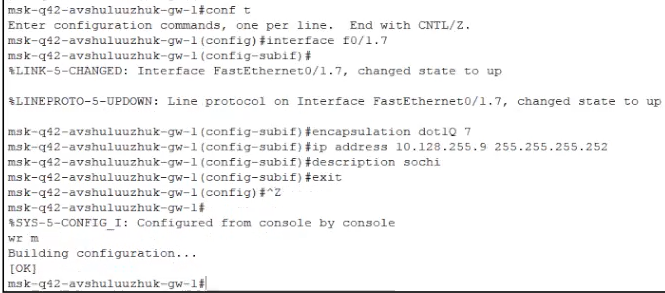{#fig:010 width=70%}

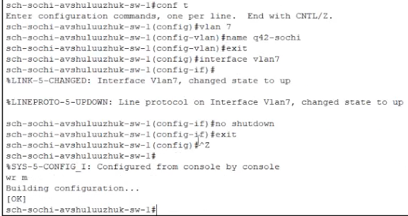{#fig:011 width=70%}

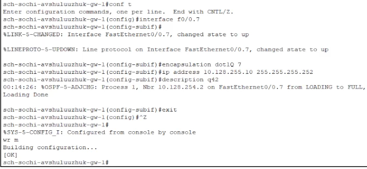{#fig:012 width=70%}

Пропингуем устройства с ноутбука администратора на Донской в Москве до компьютера пользователя на территории Сочи (рис. [-@fig:013]) (рис. [-@fig:014]) 

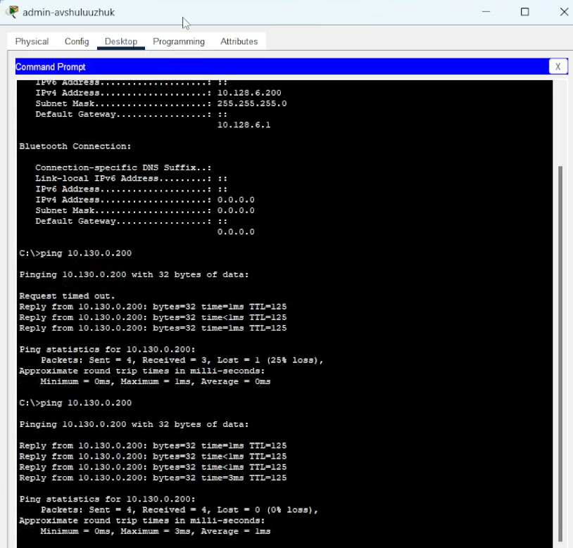{#fig:013 width=70%}

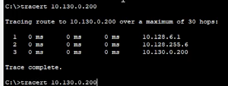{#fig:014 width=70%}

В режиме симуляции отследим движение пакета ICMP с ноутбука администратора сети на Донской в Москве (Laptop-PT admin) до компьютера пользователя в филиале в г. Сочи pc-sochi-1 (рис. [-@fig:015])

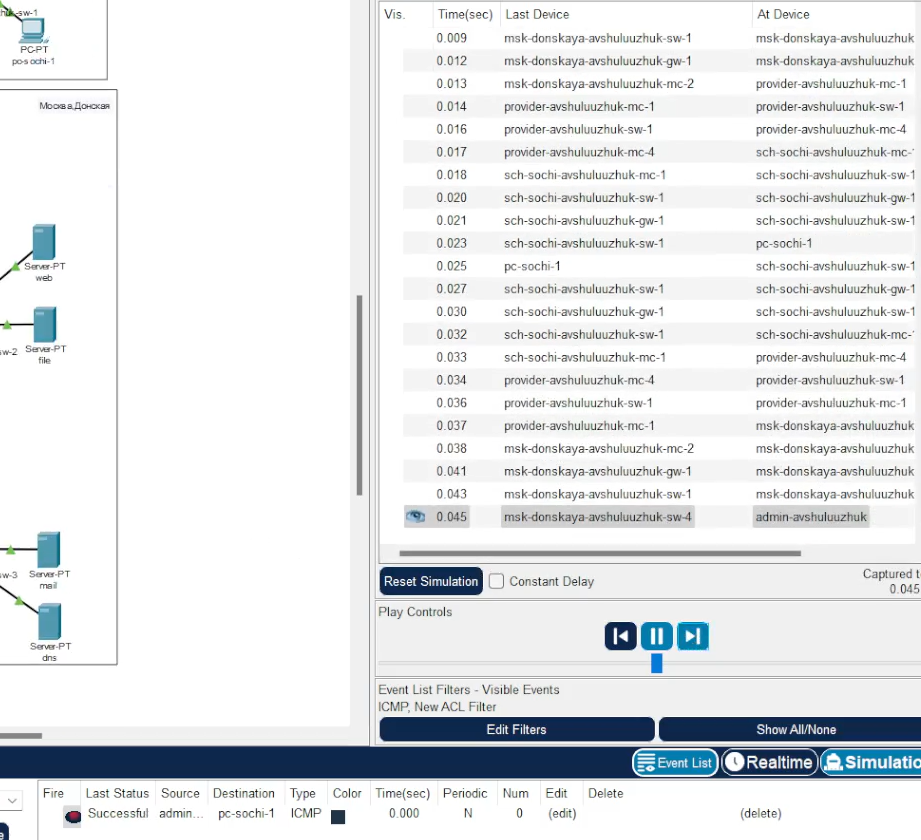{#fig:015 width=70%}

На коммутаторе провайдера отключим временно vlan 6 (рис. [-@fig:016]).

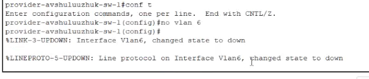{#fig:016 width=70%}

Соединение между усройствами временно пропадет и через некоторое время восстановится (рис. [-@fig:017])

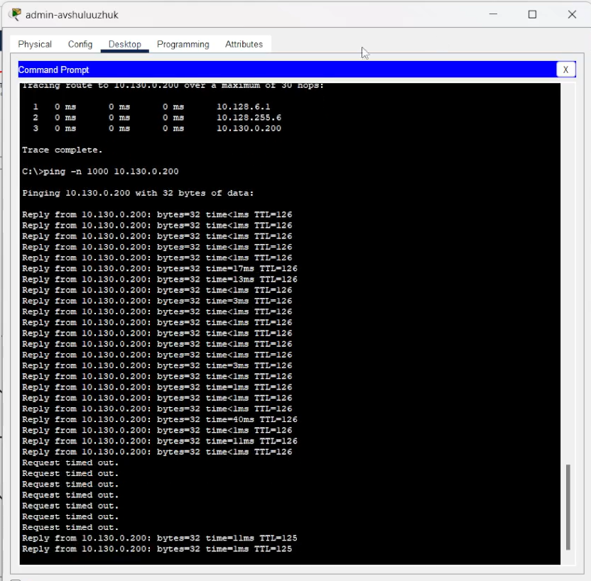{#fig:017 width=70%}

Маршрут движения пакета изменится (рис. [-@fig:018])

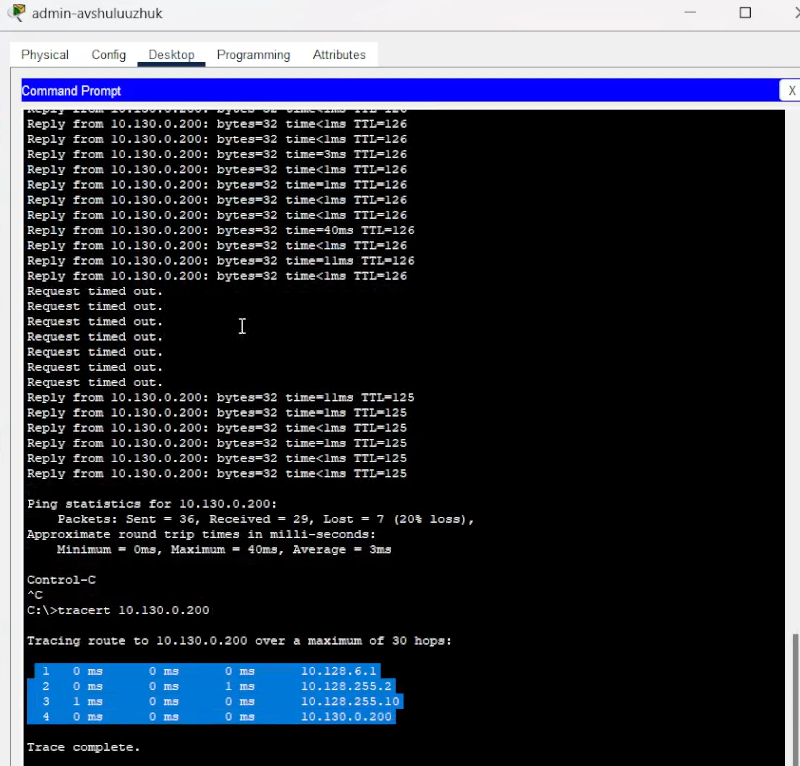{#fig:018 width=70%}

В режиме симуляции убедимся в изменении маршрута прохождения пакета ICMP с ноутбука администратора сети на Донской в Москве (Laptop-PT admin) до компьютера пользователя в филиале в г. Сочи pc-sochi-1 (рис. [-@fig:019])

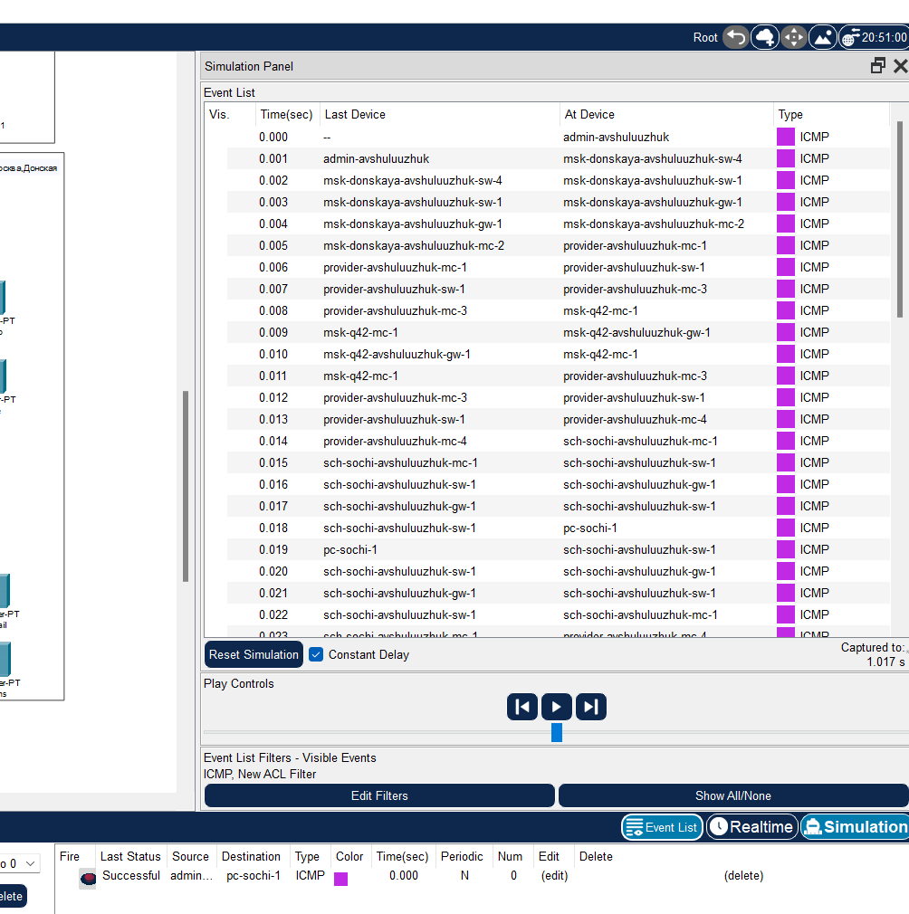{#fig:019 width=70%}

На коммутаторе провайдера восстановим vlan 6 (рис. [-@fig:020])

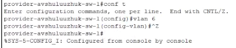{#fig:020 width=70%}

В режиме симуляции убедимся в изменении маршрута прохождения пакета ICMP с ноутбука ад-министратора сети на Донской в Москве (Laptop-PT admin) до компьютера пользователя в филиале в г. Сочи pc-sochi-1 (рис. [-@fig:021]) (рис. [-@fig:022])

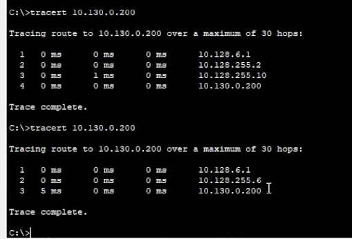{#fig:021 width=70%}

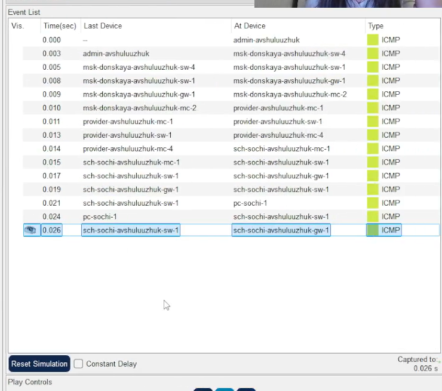{#fig:022 width=70%}

# Выводы

В результате выполнения лабораторной работы была настроена динамическая маршрутизацию между территориями организа-
ции.

# Контрольные вопросы

1. Какие протоколы относятся к протоколам динамической маршрутизации?

К протоколам динамической маршрутизации относятся такие протоколы, которые автоматически обнаруживают и поддерживают маршруты в сети, поддерживая актуальную таблицу маршрутизации без необходимости ручного ввода. Основные протоколы динамической маршрутизации включают:

    RIP (Routing Information Protocol)
    OSPF (Open Shortest Path First)
    EIGRP (Enhanced Interior Gateway Routing Protocol) — разработан Cisco
    IS-IS (Intermediate System to Intermediate System)
    BGP (Border Gateway Protocol) — в основном используется для маршрутизации между автономными системами, но также применяется для динамического обмена маршрутами внутри и между крупными сетями

2. Охарактеризуйте принципы работы протоколов динамической маршрутизации.

Протоколы динамической маршрутизации работают по следующим основным принципам:

    Обнаружение соседей: устройства обнаруживают друг друга в сети и устанавливают соединение.
    Обмен маршрутной информацией: маршрутизаторы обмениваются данными о доступных путях к разным сетям, обновляя свои таблицы маршрутизации.
    Поддержание актуальности маршрутов: протоколы используют методы периодического обмена информацией или триггерных обновлений для поддержания актуальности данных.
    Отслеживание изменений: при изменениях в сети (например, отказе маршрута или изменении стоимости пути) протоколы быстро обновляют таблицы маршрутизации.
    Выбор оптимальных маршрутов: на основе метрик (например, стоимость, задержка, пропускная способность) выбирается наиболее подходящий маршрут к каждой сети.
    Использование алгоритмов: например, RIP использует алгоритм расстояний (хопов), OSPF — алгоритм Дейкстры (Shortest Path First).

3. Опишите процесс обращения устройства из одной подсети к устройству из другой подсети по протоколу динамической маршрутизации.

Процесс обращения из одной подсети к другой по протоколам динамической маршрутизации выглядит следующим образом:

    Исходное устройство формирует IP-пакет, адресованный устройству в другой подсети.
    Если маршрут к целевой подсети уже есть в таблице маршрутизации, устройство отправляет пакет на следующий хоп (следующий маршрутизатор) согласно маршруту.
    Если маршрута нет, устройство посылает запрос или ждет обновления маршрутов через протокол динамической маршрутизации.
    Маршрутизатор, получивший запрос, использует таблицу маршрутизации для определения наилучшего маршрута к целевой подсети.
    Маршрутизатор пересылает пакет дальше по маршруту, следуя выбранному маршруту.
    Проходя через сеть, пакет достигает маршрутизатора, подключенного к целевой подсети.
    Этот маршрутизатор доставляет пакет конечному устройству в целевой подсети.
    Весь процесс сопровождается обменом маршрутной информацией между маршрутизаторами, что позволяет им обновлять свои таблицы маршрутизации и обеспечивать актуальность маршрутов.

4. Опишите выводимую информацию при просмотре таблицы маршрутизации.

При просмотре таблицы маршрутизации обычно выводится следующая информация:

    Название или IP-адрес назначения сети (Network Destination)
    Маска подсети (Subnet Mask)
    Следующий хоп (Next Hop) — IP-адрес маршрутизатора, через который нужно отправлять пакеты
    Интерфейс, через который отправляется маршрут (Interface)
    Метрика маршрута (Metric) — показатель стоимости маршрута (например, расстояние, задержка)
    Протокол маршрутизации, использованный для определения маршрута (например, RIP, OSPF, EIGRP)
    Административное расстояние (Administrative Distance) — показатель доверия к маршруту
    Статус маршрута (например, активен, статический, динамический)

