---
## Front matter
title: "Настройка VPN"
subtitle: "Лабораторная работа  № 16"
author: "Шулуужук Айраана НПИбд-02-22"

## Generic otions
lang: ru-RU
toc-title: "Содержание"

## Bibliography
bibliography: bib/cite.bib
csl: pandoc/csl/gost-r-7-0-5-2008-numeric.csl

## Pdf output format
toc: true # Table of contents
toc-depth: 2
lof: true # List of figures
lot: true # List of tables
fontsize: 12pt
linestretch: 1.5
papersize: a4
documentclass: scrreprt
## I18n polyglossia
polyglossia-lang:
  name: russian
  options:
	- spelling=modern
	- babelshorthands=true
polyglossia-otherlangs:
  name: english
## I18n babel
babel-lang: russian
babel-otherlangs: english
## Fonts
mainfont: IBM Plex Serif
romanfont: IBM Plex Serif
sansfont: IBM Plex Sans
monofont: IBM Plex Mono
mathfont: STIX Two Math
mainfontoptions: Ligatures=Common,Ligatures=TeX,Scale=0.94
romanfontoptions: Ligatures=Common,Ligatures=TeX,Scale=0.94
sansfontoptions: Ligatures=Common,Ligatures=TeX,Scale=MatchLowercase,Scale=0.94
monofontoptions: Scale=MatchLowercase,Scale=0.94,FakeStretch=0.9
mathfontoptions:
## Biblatex
biblatex: true
biblio-style: "gost-numeric"
biblatexoptions:
  - parentracker=true
  - backend=biber
  - hyperref=auto
  - language=auto
  - autolang=other*
  - citestyle=gost-numeric
## Pandoc-crossref LaTeX customization
figureTitle: "Рис."
tableTitle: "Таблица"
listingTitle: "Листинг"
lofTitle: "Список иллюстраций"
lotTitle: "Список таблиц"
lolTitle: "Листинги"
## Misc options
indent: true
header-includes:
  - \usepackage{indentfirst}
  - \usepackage{float} # keep figures where there are in the text
  - \floatplacement{figure}{H} # keep figures where there are in the text
---

# Цель работы

Получение навыков настройки VPN-туннеля через незащищённое Интернет-соединение.

# Выполнение лабораторной работы

Разместить в рабочей области проекта в соответствии с модельными предположениями оборудование для сети Университета г. Пиза (рис. [-@fig:001]) (рис. [-@fig:002]) (рис. [-@fig:003])

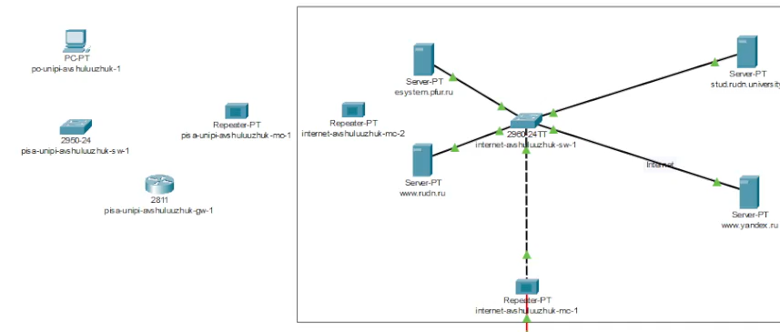{#fig:001 width=70%}

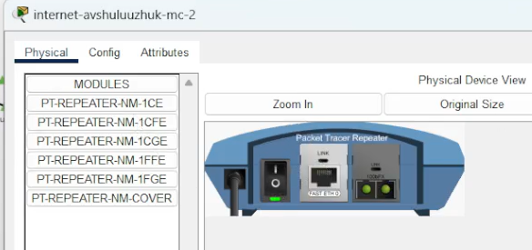{#fig:002 width=70%}

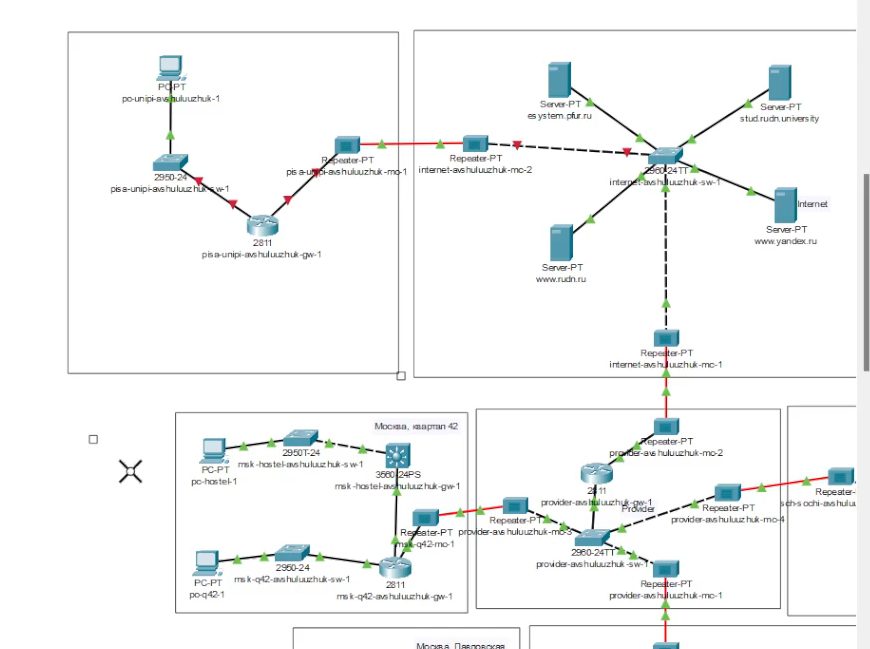{#fig:003 width=70%}

В физической рабочей области проекта создадим город Пиза, здание Университета г. Пиза. Переместим туда соответствующее оборудование (рис. [-@fig:004]) (рис. [-@fig:005]) (рис. [-@fig:006])

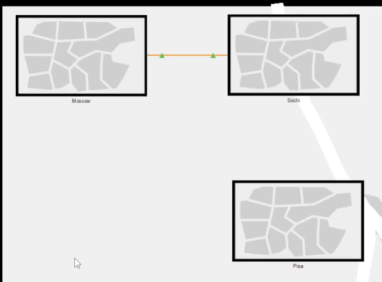{#fig:004 width=70%}

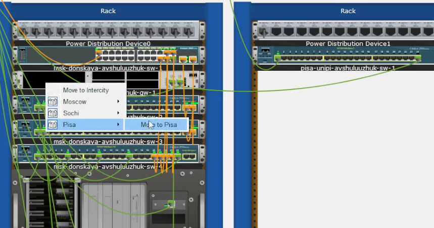{#fig:005 width=70%}

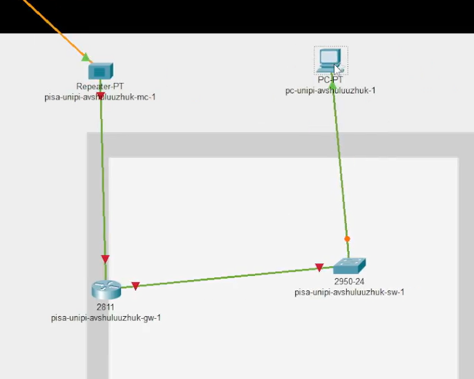{#fig:006 width=70%}

Сделаем первоначальную настройку и настройку интерфейсов оборудования сети Университета г. Пиза (рис. [-@fig:007]) (рис. [-@fig:008] (рис. [-@fig:009]) (рис. [-@fig:010]) 

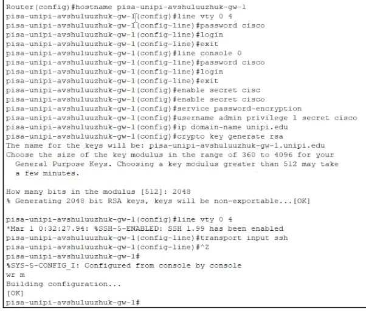{#fig:007 width=70%}

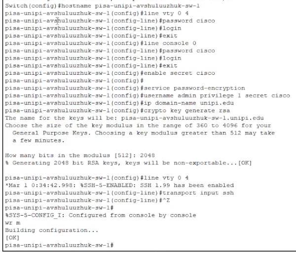{#fig:008 width=70%}

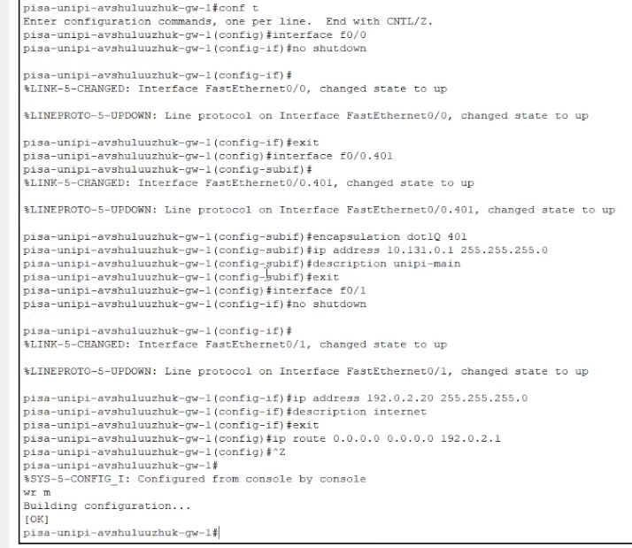{#fig:009 width=70%}

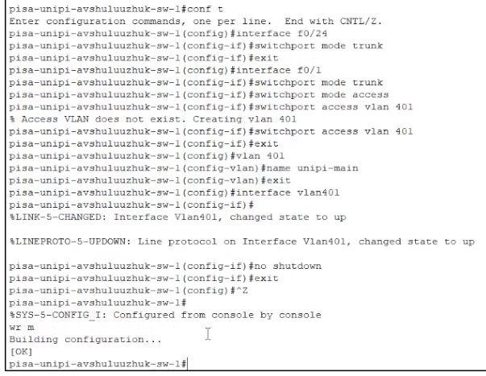{#fig:010 width=70%}

Пропишем шлюз и ip-адрес на оконечном устройстве территории г. Пиза. После проведем проверку и пропингуем устройства (рис. [-@fig:011]) (рис. [-@fig:012]) (рис. [-@fig:013]) 

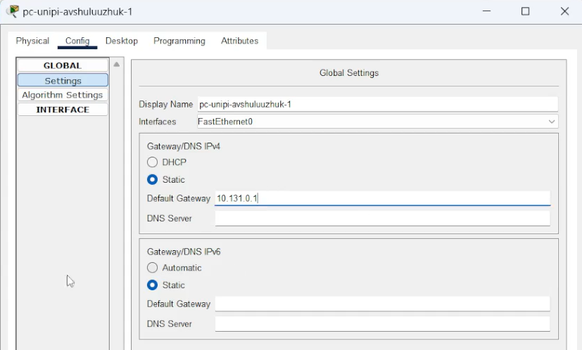{#fig:011 width=70%}

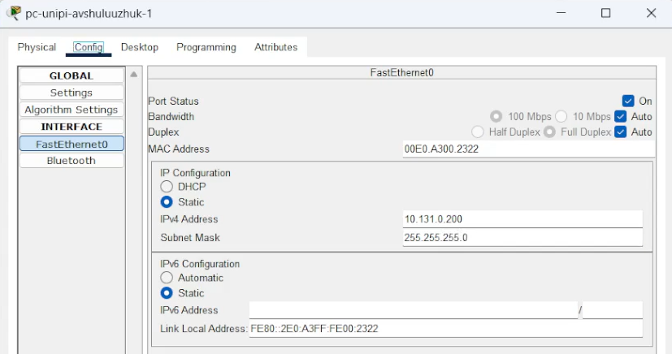{#fig:012 width=70%}

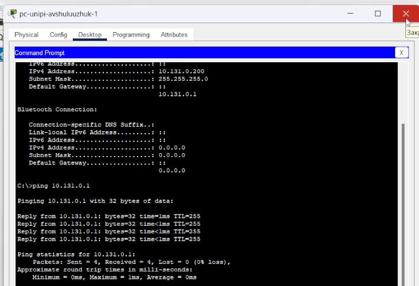{#fig:013 width=70%}

Настроем VPN на основе протокола GRE (рис. [-@fig:014]) (рис. [-@fig:015])

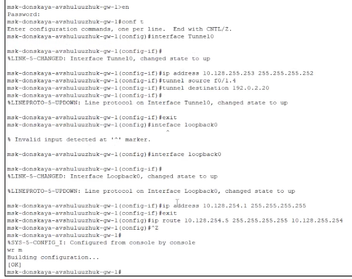{#fig:014 width=70%}

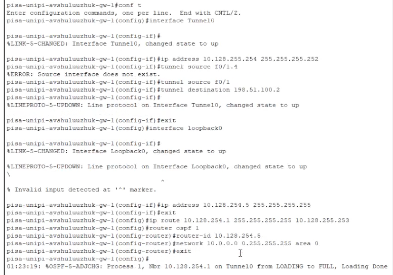{#fig:015 width=70%}

Проверим доступность узлов сети Университета г. Пиза с ноутбука администратора сети «Донская» (рис. [-@fig:016]).

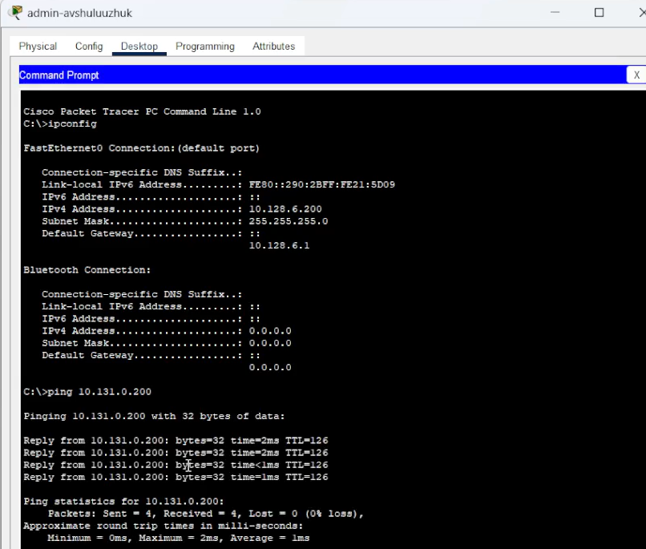{#fig:016 width=70%}

# Выводы

В результате выполнения лабораторной работы были получечены навыки настройки VPN-туннеля через незащищённое Интернет-соединение.

# Контрольные вопросы

1. Что такое VPN?

VPN (Virtual Private Network, виртуальная частная сеть) — это технология, которая создает защищённое и зашифрованное соединение между вашим устройством и удалённым сервером через интернет. Благодаря этому ваше интернет-соединение становится приватным и безопасным, а также позволяют скрыть ваш реальный IP-адрес и географическое положение.

2. В каких случаях следует использовать VPN?

    Защита личных данных и конфиденциальности при использовании публичных Wi-Fi сетей.
    Обход цензуры или блокировок сайтов и сервисов, ограниченных по регионам.
    Скрытие реального IP-адреса для анонимности в интернете.
    Получение доступа к контенту, доступному только в определённых странах.
    Обеспечение безопасности при удалённой работе и подключении к корпоративной сети.
    Защита от слежки со стороны провайдеров и государственных органов.
 
3. Как с помощью VPN обойти NAT?

NAT (Network Address Translation) — это технология, которая позволяет нескольким устройствам в локальной сети использовать один публичный IP-адрес для выхода в интернет. В большинстве случаев NAT не мешает использованию VPN, однако иногда могут возникать сложности с пробросом портов или соединениями, требующими входящих подключений.

Обойти ограничения NAT с помощью VPN можно следующим образом:

    Использовать VPN-сервисы, поддерживающие протоколы, позволяющие проброс портов или работу с режимом "VPN Passthrough".
    Настроить VPN на уровне маршрутизатора, чтобы все устройства сети автоматически использовали VPN, обеспечивая более стабильное соединение.
    Использовать протоколы VPN, которые хорошо работают с NAT, например, OpenVPN с настройками для обхода NAT или протоколы, использующие UDP-оболочки.
    В случае необходимости — настроить порт-форвардинг или использовать VPN-сервисы, предоставляющие статические IP-адреса или специальные функции обхода NAT.

